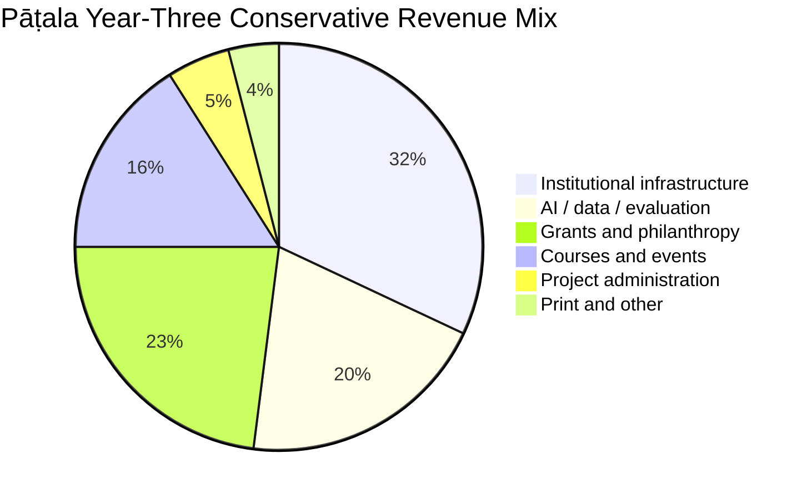
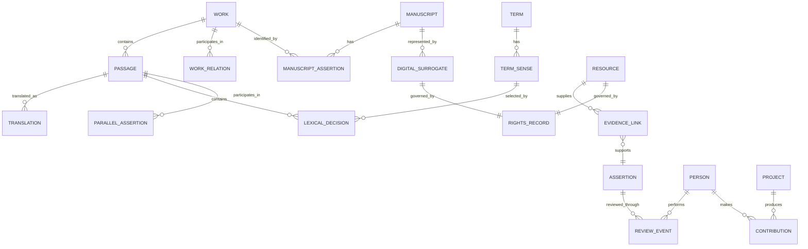
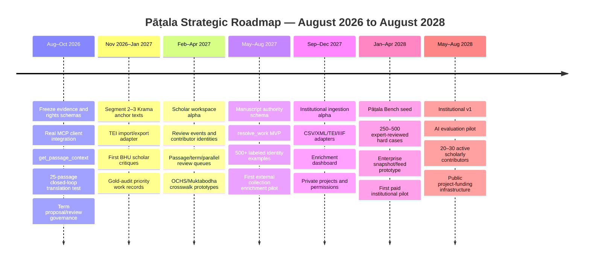
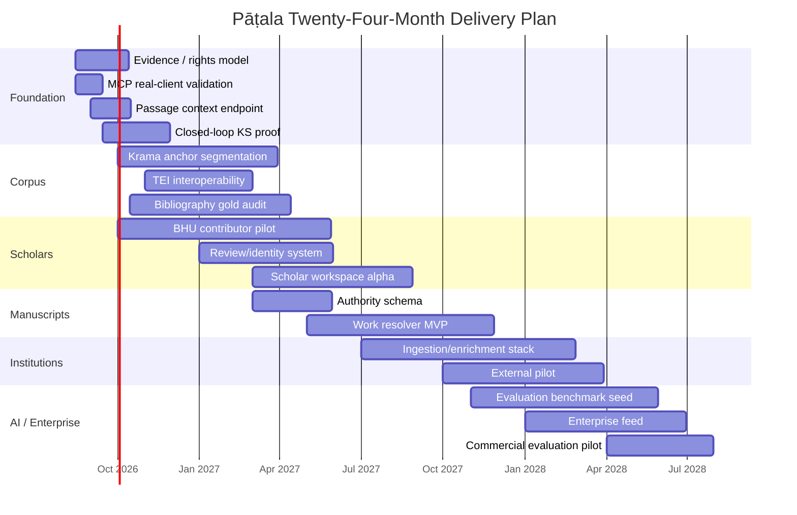

# Pāṭala: Strategic Plan for a Scholarly Intelligence Layer for Tantric Textual Heritage

## Executive summary

Pāṭala should **not** become another manuscript archive, another Sanskrit e-text repository, another generic OCR project, or a translation factory. Those layers already have serious incumbents: Gyan Bharatam is building national-scale manuscript infrastructure; Muktabodha has decades of tantric text preservation and transcription; OCHS and the Centre for Kaula Studies are building manuscript-focused collections; GRETIL, SARIT and Ambuda provide machine-readable Sanskrit; Sanskrit Heritage provides mature linguistic analysis; BDRC demonstrates large-scale linked archival infrastructure; and 84000 and SuttaCentral/Bilara demonstrate sophisticated translation and publication workflows. citeturn17view0turn0search0turn15view1turn15view0turn16search1turn6search1turn7search0turn4search1

The strategic opening is **between those layers**.

> **Pāṭala should become the authority, provenance, relationship, expert-validation and workflow layer that turns digitized tantric material into usable scholarly knowledge for humans and machines.**

The institutional job-to-be-done is not “digitize our manuscripts.” It is:

> **“We have thousands of scans, catalogue records and transcriptions. Tell us what these objects actually are, how they relate to known works and witnesses, what scholarship exists, which claims have been human-validated, what rights apply, and how researchers and AI systems can use them.”**

That market is likely to grow rather than shrink. As of August 3, 2026, India’s Gyan Bharatam Mission reported **more than 1.19 crore — 11.9 million — manuscripts** through its national survey, more than **800,000 manuscripts digitized**, and more than **440,000 available through its portal in view mode**. The government has sanctioned **₹491.66 crore — ₹4.9166 billion — for 2025–2031**. Its mandate includes cataloguing, digitization, machine-readable access, scholarship, research and a National Digital Repository. citeturn17view0 Gyan Bharatam also specifies structured metadata delivery in **CSV and XML** and fields covering source, institution, region, language, script, conservation status, date, object version, technical format and object relationships. citeturn17view2

That means the supply of digital manuscript material is likely to increase dramatically. The bottleneck moves upward:

```text
PHYSICAL MANUSCRIPT
        ↓
DIGITIZATION
        ↓
OCR / HTR
        ↓
TRANSCRIPTION
        ↓
MILLIONS OF DIGITAL OBJECTS
        ↓
────────────────────────────
        THE HARD GAP
────────────────────────────
        ↓
What work is this?
Which recension?
Which witness?
Is the catalogue title wrong?
What other copies exist?
Which edition uses it?
What does it quote?
Who has studied it?
What terms matter?
Which claims are expert-validated?
What rights apply?
        ↓
SCHOLARLY / AI USE
```

AI is accelerating the same shift. In 2025, new historical-Devanāgarī HTR datasets and models were already being developed; AnciDev contains 3,000 transcribed lines from 500 manuscript pages, while broader historical-text models such as CHURRO show the movement toward scalable vision-language OCR/HTR. Sanskrit Voyager now automatically handles search across inflection, sandhi, compounds and transliteration. In 2026, Mitrasaṃgraha released **391,548 Sanskrit–English bitext pairs**, while MITRA released **1.74 million parallel sentence pairs** spanning Sanskrit, Chinese and Tibetan together with specialist MT and semantic-retrieval models. citeturn24search4turn24search8turn24search1turn24search2turn24academia22

The conclusion is important: **first-pass translation, generic retrieval, morphology, semantic similarity and increasingly OCR/HTR are becoming cheaper capabilities rather than durable moats.** But the same Sanskrit MT research still reports substantial difficulty with compounds, philosophical concepts and layered metaphor; therefore high-quality scholarly translation is not “dead.” What is dying as a differentiated product is the *unreviewed first draft*. citeturn24search2

The scarce assets are shifting toward:

| Increasingly commoditized | Increasingly valuable |
|---|---|
| Generic OCR | Verified manuscript ↔ work identity |
| Common-script HTR | Rare-script/witness ground truth |
| Transliteration | Provenance |
| Basic Sanskrit morphology | Historical term senses |
| Sandhi/compound search | Text-family relationships |
| Draft Sanskrit → English | Expert adjudication |
| Vector similarity | Validated quotation/borrowing edges |
| Generic RAG | Rights-aware evidence graphs |
| Generic GraphRAG software | The *curated graph* itself |
| LLM-generated explanations | Trusted scholars and tradition holders |
| AI-created metadata proposals | Human acceptance/rejection histories |

This makes the current Pāṭala starting point unusually well chosen. You already have, by your accounting, **69 bibliography records, 69 normalized works, 570 stable Kramasadbhāva passages, seven live APIs, an MCP prototype and a 15-term ledger**. You have begun with identities, passage addressing, provenance and relationships rather than a consumer app. That is exactly the foundation the larger strategy requires.

The economic thesis should consequently be:

> **Keep the scholarly commons open; sell reliability, compute, curation, private workflows, collection intelligence and expert services.**

There are proven analogues. OpenAlex keeps its core scholarly data and snapshot open while charging for service tiers and institutional support; it introduced a **$5,000/year institutional membership** in 2026. Crossref operates a free public metadata API while selling Metadata Plus for higher-service use. Wikimedia keeps Wikipedia open while Wikimedia Enterprise sells commercial-grade structured delivery, snapshots and SLAs to machine customers; AI companies such as Mistral consume Wikimedia’s structured content in production. citeturn11search11turn11search21turn11search5turn11search30turn12search0turn12search8

At the same time, cultural/religious philanthropy is demonstrably capable of funding highly specialized textual infrastructure. 84000 was seeded after a 2009 gathering of roughly 50 translators, scholars, teachers and practitioners; **108 founding sponsors supplied US$5 million**. Its current sponsor-a-text tiers run from **US$20,000 for up to 50 pages to US$80,000 for 200 pages**, with sponsorship supporting research, editorial work, preservation and access rather than merely paying a translator by the page. citeturn7search0turn23search0

For Pāṭala, however, I would **not make translation bounties the economic center**. Recast them as **scholarly projects**:

```text
Manuscript identification
Critical collation
Witness transcription
Expert review
Historical terminology
Text-reuse validation
Oral-history documentation
Critical edition
Course / lecture production
```

Translation can be one deliverable inside such projects. The high-value thing is the production of **expert-reviewed, provenance-rich knowledge assets**.

The defensible moat is therefore a stack:

```text
                    BRAND TRUST
                       ↑
               SCHOLAR NETWORK
                       ↑
             REVIEW / DECISION GRAPH
                       ↑
            TERM + RELATIONSHIP DATA
                       ↑
          MANUSCRIPT IDENTIFICATION DATA
                       ↑
            PROVENANCE / RIGHTS GRAPH
                       ↑
         TANTRIC WORK AUTHORITY GRAPH
                       ↑
              OPEN SOURCE CORPORA
```

The bottom is available to competitors. The top takes years of relationships and repeated expert work to reproduce.

The near-term strategic priority should be **credibility acquisition**, not revenue maximization. BHU is a particularly useful starting environment: it has the Faculty of Sanskrit Vidya Dharma Vijnana, offers manuscriptology/paleography-related study, and was hosting explicit AI–Indian Knowledge Systems activity in 2026. citeturn18search3turn18search4turn18search14 Meanwhile, Gyan Bharatam’s official 2026 center list includes **Nagari Pracharini Sabha in Varanasi** as an Independent Centre, creating a potentially relevant manuscript-network node in the same city. citeturn17view2

The first flywheel to create is therefore not:

```text
users → subscription → profit
```

It is:

```text
accurate open infrastructure
          ↓
useful to one scholar
          ↓
scholar corrects something
          ↓
correction is credited + versioned
          ↓
Pāṭala becomes more reliable
          ↓
useful to more scholars
          ↓
institutions trust it
          ↓
paid research / data / infrastructure work
          ↓
Pāṭala pays scholars
          ↓
more expert-reviewed data
          ↓
better infrastructure
```

Everything economically interesting is downstream of that loop.

## Market landscape and defensible positioning

The competitive landscape makes more sense when divided into three layers rather than treated as eleven companies fighting for the same customer.

**Source and preservation infrastructure** includes Gyan Bharatam, Muktabodha, OCHS, Kaula Studies, IFP and manuscript custodians. **Machine-readable textual and linguistic infrastructure** includes GRETIL, SARIT, Ambuda and Sanskrit Heritage. **Workflow and linked-knowledge precedents** include BDRC, 84000 and SuttaCentral/Bilara.

Pāṭala should federate those layers rather than duplicate them.

| Player | Established strength | Limitation relative to the Pāṭala opportunity | Value Pāṭala can provide first | Concrete interoperability target |
|---|---|---|---|---|
| **Muktabodha** | Specialist tantric digital library, preservation and transcription. Muktabodha reports 3,000+ Sanskrit texts and 500+ searchable e-texts; it also works with IFP on manuscript transcription and has trained specialists in scripts including Newari. citeturn0search0turn0search3 | Its core comparative advantage is preservation/transcription and textual access, not being the universal authority/provenance/research graph described here. | Treat Muktabodha as an authoritative upstream source. Send traffic back; display its provenance prominently; give it normalized work IDs, alternate-title resolution, stable passage mappings and corrected metadata. | `source_record_id`, `source_url`, `work_id`, base edition, transcript version/hash, segment crosswalk, license/right status. Build an adapter only within permitted access terms. |
| **Gyan Bharatam** | National-scale surveying, preservation, digitization and repository infrastructure. More than 11.9m manuscripts had been reported by Aug. 2026; >800k were digitized nationally and >440k were accessible on the GB portal in view mode. citeturn17view0 | Its mission is intentionally pan-Indian and cross-domain. That breadth leaves room for specialized scholarly interpretation of one domain. | Become a **specialist enrichment layer for tantric material**, not another repository. Return work identities, candidate classifications, bibliography, witness links and expert validation. | Ingest GB CSV/XML; map its descriptive/structural/technical/administrative metadata; retain custodian identifiers and access conditions; use future NDR APIs where available. citeturn17view2 |
| **OCHS Manuscript Database** | Very close domain adjacency. Its Śākta database exposes searchable manuscript/primary-text data with provenance, photo/text availability, traditions, languages, scripts, material and place of production; its current interface shows hundreds of textual records and multiple source collections. citeturn15view1 | Strong manuscript database, but there remains room above it for cross-repository work resolution, passage-level graph relationships and machine-facing research workflows. | Offer a no-cost pilot that resolves 25–50 OCHS records to canonical Pāṭala work IDs, adds alternative titles/bibliography/relations, and returns enriched records to OCHS. | Crosswalk provenance, language, script, material, location, photo/text availability, source collection and identifiers into `manuscript_record`; export enrichment back as JSON/CSV. |
| **Centre for Kaula Studies** | Explicitly locates manuscripts in archives, temples and family collections, secures permission, transcribes across multiple scripts and produces searchable e-texts. citeturn15view0 | The labor-intensive source-acquisition layer is its strength; Pāṭala should not imitate that network from scratch. | Become the post-transcription research infrastructure: passage IDs, edition/source lineage, concordance, relations, review workspace, publication API. | Receive permitted transcript + metadata; map incipit/colophon, script, custodian, permission status and source identity; output stable passages and TEI/JSON. |
| **GRETIL** | Long-standing cumulative registry of freely available machine-searchable electronic Indic texts, with emphasis on normalized machine-readable files for scholarship. citeturn3search0turn3search5 | Broad Sanskrit/Indology rather than specialist tantric authority and provenance. Source quality and rights need to be assessed per item rather than treated as uniform. | Normalize tantric works found in GRETIL and point back to the source rather than presenting Pāṭala as the origin. | Import source URL, title, author, edition/transcription statement and item-level rights; compute text hashes; map segments to canonical passage IDs. |
| **SARIT** | Excellent technical precedent: TEI P5 texts, rich `teiHeader` provenance, `xml:id`, revision histories and explicit item licensing; its corpus is maintained on GitHub. citeturn16search1turn16search9turn16search18 | General scholarly Indic corpus rather than a tantric research graph. | Treat SARIT as the cleanest TEI interoperability test. Build loss-minimizing import/export and return upstream corrections through normal scholarly channels. | `teiHeader` → resource/provenance; `xml:id` → external passage identity; `div/lg/l` → structure; `revisionDesc` → lineage; `availability/licence` → rights. |
| **Ambuda** | Open Sanskrit library with downloadable structured texts; its TEI files contain rich `teiHeader` metadata and stable text slugs. citeturn3search1 | General Sanskrit reading/corpus infrastructure rather than tantra-specific authority resolution. | Use as an upstream corpus source and potential cross-link, while contributing improved work/source metadata where useful. | TEI ingest, source slug crosswalk, author/title/source mappings, passage segmentation; retain original IDs as `sameAs`. |
| **BDRC / BUDA** | Probably the best architectural analogue. BDRC combines digital archive, e-text/image access, **IIIF**, Linked Open Data, authority relationships and dataset delivery across Buddhist traditions. It is also working on HTR and advanced text processing. citeturn6search1turn6search5 | Buddhist scope rather than a general Śaiva–Śākta–tantric authority service. | Learn rather than compete. Cross-link Buddhist tantric works and people; seek technical dialogue about LOD/IIIF practices. | IIIF manifests, LOD/JSON-LD, external work/person/place IDs, `sameAs`, image regions and cross-language work identity. |
| **84000** | Highly professional translation organization with proven fundraising, editorial workflows and increasingly AI-assisted translator tooling. Its partner Khyentse Foundation reports that 84000 is exploring AI for source comparison, version analysis, glossary consistency and research while retaining human stewardship. citeturn7search0 | Canon-specific translation mission. Pāṭala should not compete by becoming a Śaiva equivalent whose whole value is producing English prose. | Exchange workflow lessons; link Buddhist tantric parallels; explore future interoperability on cross-traditional works and terminology. | Canonical work/passages, translation references, glossary mappings, parallel relationships, provenance; use only material whose license/partner terms permit machine reuse. |
| **SuttaCentral / Bilara** | One of the strongest open translation-data patterns: JSON records keyed by stable segment IDs, with root texts, translations, comments/variants and Git-based publication/version control. citeturn4search1turn4search3 | Designed for Buddhist canonical translation, not manuscript identification and tantric historical relations. | Borrow the software architecture ideas rather than reinvent them. | Immutable segment IDs, translation version lineage, review roles, root/translation/comment distinction, Git-compatible change history. |
| **Sanskrit Heritage** | Mature tools for Sanskrit segmentation, morphology, lemmatization, sandhi and parsing; its Sanskrit Reader already addresses language-analysis tasks Pāṭala would otherwise spend years rebuilding. citeturn5search0turn5search3 | It solves linguistic processing, not historically situated tantric interpretation. | Integrate or deep-link to language-analysis functionality where terms permit; do not build a universal Sanskrit parser. | Store morphological output with `tool`, `version`, `candidate_analysis` and confidence rather than treating automated morphology as editorial truth. |

The most important additional potential upstream partner is the **Institut Français de Pondichéry**. Its official manuscript description reports **8,187 palm-leaf bundles, 360 paper codices and 1,144 recent paper transcripts**, with nearly half of the collection concerned with Śaivism; its Śaiva Siddhānta manuscript collection is internationally significant and UNESCO-recognized. citeturn13search2 Muktabodha’s existing collaboration with IFP is further evidence that the correct ecosystem behavior is cooperation rather than trying to own every stage of the stack. citeturn0search0

The resulting niche can be stated very precisely:

> **Pāṭala resolves, connects, contextualizes, validates and operationalizes tantric textual heritage.**

Or, more technically:

> **Pāṭala is the domain authority and evidence graph between manuscript repositories, textual corpora, scholars and AI systems.**

The canonical institutional flow should be:

```text
             CUSTODIANS / ARCHIVES
                       │
       Gyan Bharatam · IFP · OCHS
       private collections · libraries
                       │
                       ▼
              DIGITAL OBJECTS
                       │
      Muktabodha · Kaula Studies
       GRETIL · SARIT · Ambuda
                       │
                       ▼
              ┌────────────────┐
              │  TANTRAKOŚA    │
              │                │
              │ work authority │
              │ provenance     │
              │ text relations │
              │ term history   │
              │ scholar review │
              │ rights         │
              └───────┬────────┘
                      │
          ┌───────────┼────────────┐
          ▼           ▼            ▼
       SCHOLARS     INSTITUTIONS    MACHINES
       workspace    collection AI   API/MCP
          │           │              │
          └───────────┼──────────────┘
                      ▼
               PUBLIC LEARNING
```

That positioning also reduces competitive risk. If Muktabodha gains AI tools, Pāṭala still benefits because it gains a better upstream corpus. If Gyan Bharatam improves OCR, Pāṭala benefits because more manuscripts become usable. If general Sanskrit translation becomes excellent, Pāṭala benefits because its expert reviewers can process more material. If GraphRAG becomes trivial to deploy, Pāṭala benefits because its graph is better.

A good business is usually in trouble when its suppliers improve. **Pāṭala should be designed so upstream progress makes it more valuable.**

The largest strategic competitive risk is not an existing Tantra site. It is an established archive or large AI provider eventually deciding to build the same authority/validation layer. The defense is to become the **trusted collaborative standard before that happens**: stable IDs adopted by scholars, crosswalks used by repositories, validation histories, institutional relationships and a contributor network.

That means “market share” should initially be measured less by page views than by signals such as:

| Credibility metric | Why it matters |
|---|---|
| External sources correctly cross-linked | Federation rather than extraction |
| Gold-audited work identities | Authority quality |
| Scholar-reviewed assertions | Trust |
| External projects using Pāṭala IDs | Standard adoption |
| Corrections returned upstream | Partner value |
| Papers/projects citing the API | Academic usefulness |
| Institutions exporting/importing the schema | Infrastructure adoption |
| Reviewers returning for a second project | Scholar retention |
| Paid scholars in India/Nepal | Mission + relationship depth |
| Machine outputs that expose evidence provenance | Differentiation from generic RAG |

That is the path to the moat.

## AI trajectory and where the puck is going

The last two years have already changed what is economically rational to build.

Historical manuscript recognition is moving from bespoke OCR systems toward pretrained and multimodal systems that can be fine-tuned on relatively small specialist datasets. The 2025 AnciDev project specifically targets historical Devanāgarī and demonstrates the value of ground-truth manuscript lines for fine-tuning; another 2025 study focuses directly on HTR for early Devanāgarī manuscripts. CHURRO, meanwhile, was trained around a historical-document dataset approaching 100,000 documents, illustrating the broader move toward general-purpose historical text recognition. citeturn24search0turn24search4turn24search8

Sanskrit search is also moving beyond literal substrings. Sanskrit Voyager, presented in 2025, searches words as they occur in texts while automatically handling inflection, sandhi, compound forms and transliteration variation. That makes your current substring-based `find_term_occurrences` useful as a temporary architectural stub but **not a capability around which to build a moat**. citeturn24search1

Machine translation is accelerating even faster. Mitrasaṃgraha’s 391,548 Sanskrit–English pairs cover multiple historical periods and domains, and its experiments significantly improve specialist translation models while explicitly finding persistent difficulty in compounds, philosophy and metaphor. citeturn24search2turn24search6 MITRA goes further: its 2026 pipeline mines 1.74 million multilingual parallel sentence pairs among Sanskrit, Buddhist Chinese and Tibetan and trains specialist models for both MT and semantic retrieval. citeturn24academia22

Retrieval architecture itself is similarly moving toward commoditization. Knowledge-graph-guided RAG, LightRAG and subsequent graph-RAG systems use explicit graph relationships to expand and structure retrieval; the technical idea “use graph structure instead of vector similarity alone” is therefore no longer a proprietary insight. citeturn24search10turn24search21turn24search3

The crucial distinction is:

> **GraphRAG is not the moat. The verified graph is.**

Anyone can deploy a graph database. Very few people can establish, with evidence, that:

```text
Passage A is probably quoted by Passage B.

Manuscript NAK X is a witness of Work Y rather
than the similarly titled Work Z.

kula in this specific passage carries technical
sense S rather than generic sense G.

Scholar P accepted that identification in revision R,
while Scholar Q disputed it for reason E.
```

That is the expensive layer.

A reasonable 2026–2029 capability forecast, explicitly an inference from the current trajectory rather than a certainty, is:

| Capability | Likely status by 2029 | Pāṭala response |
|---|---|---|
| Modern printed Sanskrit OCR | Commodity | Do not build |
| Common Devanāgarī HTR | Low-cost/near commodity for clean material | Integrate providers; keep validation |
| Newari/Śāradā/Grantha and difficult manuscript HTR | Much better but still dataset-dependent | Acquire consented gold transcriptions; never make OCR itself the product |
| Transliteration | Commodity | Utility |
| Morphological analysis | Commodity-ish | Integrate; preserve alternatives |
| Sandhi/compound-aware search | Commodity | Replace substring search with external/open linguistic stack |
| Generic Sanskrit–English draft translation | Cheap and increasingly strong | Use internally; never market as the core moat |
| Publishable philosophical translation | AI-assisted but still expert-sensitive | Store human review decisions, not just final English |
| Semantic parallel discovery | Strong/cheap | Use AI for candidate generation |
| **Validated** quotation/borrowing relationships | Scarce | Core asset |
| Vanilla RAG | Commodity | Do not differentiate on it |
| GraphRAG implementation | Commodity | Let the graph be the asset |
| Manuscript candidate classification | Increasingly automated | Build human validation workflow |
| **Canonical manuscript identification** | Scarce | Core institutional product |
| Historical technical-term interpretation | AI-assisted but evidence-sensitive | Core expert dataset |
| Rights/provenance reasoning | Continually difficult | Core infrastructure |
| Reliable expert disagreement data | Extremely scarce | Core moat |
| Lived/traditional interpretation | Intrinsically human and relational | Record ethically as attributed knowledge, not anonymous “ground truth” |

This is why I would refine the phrase “translation is dead.”

**Commodity translation is dying as a product. Translation scholarship is not.**

The future workflow is more likely:

```text
AI:
draft
parse
retrieve parallels
detect possible issue
propose term sense
compare witnesses

           ↓

SCHOLAR:
accept
reject
correct
qualify
supply historical argument
identify tradition-specific nuance

           ↓

TANTRAKOŚA:
stores the decision + evidence
```

The valuable artifact is therefore not simply:

```text
Sanskrit → English
```

It is:

```text
Sanskrit
   ↓
machine proposal
   ↓
human correction
   ↓
WHY corrected
   ↓
supporting evidence
   ↓
reviewer identity + expertise
   ↓
version history
```

That is much more useful as future training/evaluation data.

**What not to build** follows directly from this analysis:

| Do not make this a strategic product | Why |
|---|---|
| Generic OCR engine | Large public/industrial efforts are already moving quickly |
| Universal Sanskrit parser | Sanskrit Heritage and newer NLP stacks already attack this |
| Generic Sanskrit search | Voyager-style tools increasingly handle morphology/sandhi/compounds |
| Foundation model | Capital intensive and unnecessary |
| “TantraGPT” | Model capability will be copied; sources/validation will not |
| Mass AI-translated library | Low credibility and rapidly commoditizing |
| Giant scan repository | Gyan Bharatam, IFP, BDRC and custodians own this layer |
| Closed scholarly API | Destroys ecosystem/network adoption |
| Generic vector database/RAG | Commodity infrastructure |
| Consumer app before the scholarly core is credible | Creates attention but not a moat |
| Physical manuscript acquisition as default | Conservation, provenance, insurance and trust burden; partnerships are better |
| Uncontrolled translation wiki | Corrupts authority |
| Freelancer marketplace before research workflow | Scholars and funders will simply disintermediate you |

There is one additional human category that deserves deliberate treatment: **lived transmission**.

A philologist, a Sanskrit paṇḍit, a ritual specialist, a lineage holder and a practitioner may possess different types of authority. The platform should not flatten them.

A future knowledge resource should support something like:

```json
{
  "type": "interpretive_testimony",
  "speaker_role": "traditional_teacher",
  "tradition": "krama",
  "concepts": ["uccara", "krama"],
  "passages": ["tantra:text:kramasadbhava:1.14"],
  "claim_type": "practice_interpretation",
  "recorded_at": "Tantrakosa seminar, Varanasi",
  "consent": {
    "public_display": true,
    "transcription": true,
    "rag": true,
    "model_training": false
  }
}
```

That material is scarce precisely because it depends on trust, access and embodied human experience. But it should **not** automatically be treated as philological proof or mined for AI simply because it was recorded. It is better understood as a provenance-rich, attributed interpretive layer.

That distinction may become an important part of Pāṭala’s reputation:

> **the machine knows what kind of authority it is quoting.**

## Moats, defensible data assets and the open-commons strategy

The strategic mistake would be believing that “ownership of Sanskrit text” is the moat.

For the most important public-domain or openly available material, it is not. Other projects can obtain the same text. The moat must be produced through **transformation, validation, relationships and accumulated trust**.

I would rank the future data assets this way:

| Asset | How it is created | Defensibility | Default openness | Commercial value |
|---|---|---:|---|---|
| Normalized Sanskrit files | Automated/manual cleanup | Low | Open where source rights allow | Low |
| Bibliography | Editorial curation | Medium | Open | Discovery/API |
| Canonical work authority | Years of title/identity reconciliation | High | Open IDs + core metadata | Enterprise synchronization |
| Passage identity graph | Stable segmentation and cross-edition mapping | High | Open | API/enterprise feeds |
| Manuscript authority graph | Repository and witness reconciliation | Very high | Core metadata open where permitted | Institutional enrichment |
| Provenance graph | Source/edition/witness lineage | Very high | Open core | Reliable AI/research feeds |
| Rights graph | Custodian + item-specific permissions | High | Public status; details as appropriate | Safe machine use |
| Historical term senses | Scholar-adjudicated occurrence data | Very high | Accepted senses preferably open | Evaluation/context APIs |
| Validated textual parallels | Machine discovery + expert review | Very high | Many can be open | Retrieval/evaluation |
| Translation correction history | AI drafts + expert change reasons | Very high | Final translations may be open; review dataset permission-dependent | Model evaluation/training |
| Manuscript identification examples | Catalogue + image/text + accepted identity | Extremely high | Mixed because of custodian rights | Institutional/AI |
| Expert-review graph | Who accepted/rejected what and why | Extremely high | Attribution visible; detailed ML use consented | Benchmark/training |
| Scholar network | Repeated relationships | Extremely high | Not “owned” | Everything downstream |
| Recorded lectures/oral knowledge | Commissioned with explicit rights | High | Contract-dependent | Courses, RAG, research, media |

This leads to a strong open-data policy:

> **Open factual scholarly infrastructure wherever rights permit; monetize the expensive ways of producing, validating, delivering and operating it.**

That is not merely idealistic. Open scholarly infrastructure already uses exactly this pattern. OpenAlex’s model is explicitly based around free underlying scholarly data plus paid service/membership layers; Crossref’s metadata remains freely queryable while commercial-grade services provide higher assurance; Wikimedia Enterprise commercializes reliable structured delivery without enclosing Wikipedia itself. citeturn11search11turn11search21turn11search30turn12search0

A sensible Pāṭala access stack is therefore:

```text
OPEN

work identities
bibliography
basic passage API
publicly distributable texts
relations
citation metadata
reasonable search
basic MCP
public scholar contributions
public accepted terminology
public datasets where rights allow

────────────────────────────────

PAID SERVICES

institutional ingestion
private project hosting
high-volume API
private MCP
custom curation
collection reconciliation
expert review coordination
large semantic jobs
dataset preparation
SLAs
daily snapshots
webhooks/deltas
private manuscript workflows
benchmark execution
commercial evaluation
bespoke data licensing where rights allow
```

This also protects against the classic open-source-business trap. Pāṭala should not charge for the **fact** that the Kramasadbhāva exists. It can charge an institution to reconcile 20,000 catalogue objects against a high-quality tantric authority graph, maintain those mappings, route unresolved candidates to qualified experts, and export verified results into the institution’s systems.

The strongest long-term commercial asset may be an **evaluation suite**, not a training dataset.

Consider:

```text
TANTRAKOŚA BENCH

Historical Devanāgarī HTR
Newari manuscript recognition
Work identification
Incipit matching
Sanskrit segmentation
Compound parsing
Technical-term sense selection
Tantric Sanskrit translation
Quotation detection
Textual-relative retrieval
Historical dating attribution
Evidence citation
Hallucination resistance
```

Each example has:

```text
gold input
expert answer(s)
evidence
known ambiguity
difficulty classification
review provenance
```

This matters because religious/philosophical translation often admits more than one legitimate rendering. A benchmark can therefore hold **multiple adjudicated references and structured disagreement**, instead of rewarding a model only when it reproduces one English sentence. Current work on Sanskrit MT itself emphasizes difficult philosophical and metaphorical cases, reinforcing the value of domain-specific hard-case evaluation. citeturn24search2

The same idea applies to manuscript identification.

A valuable gold record might be:

```text
catalogue title: "Kubjikatantra"
incipit: ...
colophon: ...
script: Newari
date estimate: ...
repository: ...
OCR proposal: ...
model candidate:
  Kubjikamata 0.76
  Satsahasrasamhita 0.18

human judgement:
  Kubjikamata

reviewer:
  specialist X

reason:
  colophon + known opening sequence + folio structure
```

A thousand records like that may be more defensible than a million unreviewed OCR lines.

The scholar network then becomes a **data-production engine**, but the relationship has to be reciprocal. Scholars should not feel that Pāṭala is quietly turning their unpaid intellectual labor into proprietary training data. Creative Commons itself notes that the application of CC licensing to AI training is legally and technically complex and has been developing explicit machine-use preference signals to give dataset holders greater agency. citeturn22search0turn22search2turn22search8

The rule should therefore be:

> **Never smuggle ML permission inside generic “we may use your contribution” language.**

Use separate machine-use permissions and have actual counsel review the contributor agreement before commercial AI licensing. CC guidance itself stresses that copyright licenses do not settle every legal issue around AI training and that other rights may still matter. citeturn22search6

For every resource, build the rights matrix now:

```text
public_display
download
redistribution
api_fulltext
embedding
rag
model_training
fine_tuning
evaluation
commercial_feed
derivative_dataset
```

And make `unknown` a valid answer.

Gyan Bharatam itself provides an instructive precedent: its latest official statement says public access to digitized manuscripts is governed by custodial/rightsholder rights and that sensitive, restricted or protected material may have different access conditions. **Viewable is not synonymous with trainable.** citeturn17view0

The ultimate moat is thus not secrecy. It is a difficult-to-reproduce combination:

```text
OPENNESS
makes Pāṭala broadly adopted

        +

CREDIBILITY
makes scholars trust it

        +

RELATIONSHIPS
bring unique knowledge/access

        +

WORKFLOW
captures review decisions

        +

PROVENANCE
makes the data reliable

        +

RIGHTS
make commercial use legitimate
```

That combination is much harder to copy than a paywalled database.

## Economics, capital sources and financial model

Pāṭala potentially sits at the intersection of **five distinct capital markets**.

The first is **public/cultural infrastructure funding**. Gyan Bharatam’s ₹491.66-crore 2025–2031 commitment demonstrates the scale of India’s current manuscript policy. The mission’s five verticals cover survey/cataloguing, conservation/capacity, technology/digitization, linguistics/translation, and research/publication/outreach. citeturn17view2

The second is **Indian Knowledge Systems funding**. A recent IKS Center call offered up to **₹5 lakh per year for two years**, required a 100% institutional cash match, supported research fellows/project associates/interns and explicitly required research, education/mentoring and outreach pillars. It also strongly encouraged interdisciplinary work and required someone able to read primary texts without translation. citeturn20view0turn21view1 That is not enormous money, but it is almost a template for a BHU-associated early research program rather than startup capital.

The third is **international humanities/preservation funding**. For example, the current NEH Collections Stewardship program can support up to **US$350,000 for a single organization and US$500,000 for a consortium**, including work on metadata, digital surrogates, transcriptions and indexes. citeturn13search3 These routes normally become realistic through eligible institutional partners rather than a solo founder.

The fourth is **philanthropy/patronage**. 84000 demonstrates that a highly specialized textual mission can attract substantial patron funding, including the $5m founding sponsorship and today’s $20k–$80k sponsor-a-text tiers. citeturn7search0turn23search0

The fifth is **commercial scholarly/AI infrastructure**, where OpenAlex, Crossref and Wikimedia Enterprise offer the closest analogues for “open underlying knowledge, paid professional delivery.” citeturn11search21turn11search30turn12search0

I would prioritize the revenue streams as follows:

| Revenue stream | Earliest realistic stage | Suggested launch pricing hypothesis | Strategic quality | Main risk |
|---|---:|---:|---|---|
| **Institutional enrichment pilot** | 12–18 months | US$5k–15k for a bounded 8–12 week pilot | Excellent | Need proven workflow |
| **Institutional annual workspace** | 18–30 months | US$12k–30k small project; US$40k–100k larger collection/consortium | Excellent recurring | Procurement cycles |
| **Enterprise structured feed/API** | 24+ months | US$25k–75k/year initially | Excellent | Must offer unique data/SLA |
| **AI evaluation engagement** | 18–30 months | US$10k–40k per model/benchmark study | Very strong | Gold benchmark expensive |
| **Annual AI benchmark licence** | 30+ months | US$50k–150k depending scope | Very strong | Requires recognized benchmark |
| **Custom expert dataset** | 24+ months | US$25k–150k+ | Strong | Rights + scholar labor |
| **Research project administration** | 12+ months | Transparent 8–12% or fixed technical fee | Mission-aligned | Financial/legal administration |
| **Philanthropic project sponsorship** | As soon as credibility exists | Project-specific | Excellent | Lumpy |
| **Courses** | 12–24 months | US$49–149 self-paced; US$150–500 live/scholar-led | Good | Audience acquisition |
| **Consumer membership** | 18+ months | US$6–12/month | Good | Requires product depth |
| **Events/seminars** | 12–24 months | Cost + program margin | Good | Operational overhead |
| **Study retreats** | 24+ months | Program fee perhaps US$250–750 plus direct venue/travel costs | Good later | Logistics/liability |
| **Print editions** | 24+ months | US$25–60 typical specialist volume hypothesis | Small but credible | Low-margin fulfillment |

Those are **planning hypotheses**, not observed market clearing prices. They should be tested through pilots.

The institutional range is intentionally above an ordinary SaaS subscription because the product is partly expert curation. OpenAlex’s $5,000/year institutional membership provides a useful lower-end open-infrastructure reference point; Pāṭala collection enrichment would include considerably more labor and domain-specific analysis than a basic membership. citeturn11search21

Likewise, do not interpret 84000’s $20,000-per-50-page sponsorship as a market price Pāṭala should copy. It is evidence that patrons can underwrite serious textual projects, not a signal to build a per-page translation factory. citeturn23search0

A better Pāṭala funded project is:

```text
PROJECT: Map the Early Krama Corpus

Budget                       $12,000

Scholar lead                  $4,000
Research assistants           $2,500
Specialist reviewer           $1,500
Data engineering              $1,500
Editorial/publication           $750
Platform/admin                  $750
Contingency                   $1,000

Outputs

• 8 gold-audited work records
• 6,000 segmented passages
• 150 validated term occurrences
• 100 candidate textual parallels
• 30 scholar-reviewed parallels
• one public research essay
• one lecture
• one downloadable dataset
• API/MCP enrichment
```

The money produces assets across the entire platform rather than only an English translation.

A **three-year modeled financial scenario** is below. All figures are US$000 and should be read as planning cases, not forecasts. Restricted/project funds passed directly to scholars are intentionally not treated as operating revenue here; only Pāṭala’s earned/admin portion should be counted for strategic modeling.

| | Conservative Y1 | Conservative Y2 | Conservative Y3 | Optimistic Y1 | Optimistic Y2 | Optimistic Y3 |
|---|---:|---:|---:|---:|---:|---:|
| Institutional | 5 | 30 | 70 | 15 | 80 | 190 |
| AI/data/evaluation | 0 | 10 | 45 | 5 | 50 | 160 |
| Grants/donations | 15 | 30 | 50 | 30 | 60 | 100 |
| Courses/events | 3 | 15 | 35 | 5 | 40 | 120 |
| Project/admin fees | 2 | 5 | 10 | 5 | 15 | 45 |
| Print/other | 0 | 0 | 10 | 0 | 5 | 35 |
| **Revenue** | **25** | **90** | **220** | **60** | **250** | **650** |
| **Operating cost** | **65** | **120** | **190** | **90** | **190** | **420** |
| **Surplus / burn** | **−40** | **−30** | **+30** | **−30** | **+60** | **+230** |

The conservative model implies a maximum cumulative operating deficit of roughly **$70k by the end of year two**, so a sensible seed target would be nearer **$90k–120k** to retain working-capital margin. The optimistic case reaches self-sufficiency earlier but assumes meaningful institutional and enterprise execution.

A five-year extension illustrates the possible scale without pretending it is predictable:

| Scenario | Y4 revenue / cost | Y5 revenue / cost | Conditions required |
|---|---:|---:|---|
| **Conservative** | $350k / $280k | $525k / $380k | 4–8 institutions; small AI/eval business; grants remain meaningful; modest course audience |
| **Optimistic** | $1.1m / $700k | $1.8m / $1.0m | 8–15 institutional relationships; multiple enterprise AI contracts; recognized benchmark; successful educational/events layer |

The optimistic case is not a “Tantra website gets two million dollars” story. The revenue would come from a portfolio:

```text
institutional infrastructure
+
AI evaluation/data
+
research grants
+
patron-funded projects
+
courses/events
+
consumer support
```

That diversity is desirable because no single stream should be allowed to dictate the project’s scholarly agenda.

A plausible conservative year-three mix looks like this:



The corresponding cost structure should remain research-heavy:

| Cost center | Conservative Y1 | Conservative Y2 | Conservative Y3 |
|---|---:|---:|---:|
| Product/engineering/founder compensation | $25k | $42k | $65k |
| Research/data staff | $15k | $25k | $40k |
| Scholar honoraria/review | $8k | $15k | $25k |
| Infrastructure/model/API costs | $5k | $10k | $18k |
| Legal/accounting/rights | $6k | $10k | $15k |
| Partnerships/travel | $6k | $10k | $15k |
| Education/marketing/events | — | $8k | $12k |
| **Total** | **$65k** | **$120k** | **$190k** |

This assumes a geographically distributed, India-heavy team and substantial founder contribution. A Western-market salary structure would raise it materially.

The most interesting eventual economic mechanism is the **knowledge treasury**:

```text
EARNED REVENUE + DONATIONS + GRANTS
                  ↓
            OPERATING COSTS
                  ↓
                RESERVE
                  ↓
          TANTRAKOŚA KNOWLEDGE FUND
                  ↓
     ┌────────────┼────────────┐
     ▼            ▼            ▼
  scholars    digitization   fieldwork
     │            │            │
     └────────────┼────────────┘
                  ▼
          NEW VERIFIED ASSETS
                  ↓
      stronger API / institution /
       AI / educational products
                  ↓
             more revenue
```

In the long run, that is much more powerful than maximizing extraction from every API request.

## Product and data architecture

The current architecture is already pointed in the correct direction. The highest-priority work now is **hardening epistemic structure rather than adding features**.

The term ledger should immediately distinguish **accepted knowledge from proposals**:

```text
AI / translator decision
         ↓
term_sense_proposal
         ↓
editor / scholar review
         ↓
accepted / rejected / revised
         ↓
accepted term_sense
```

No translating agent should ever be allowed to create its own precedent and then retrieve that precedent later as established corpus knowledge.

Likewise, the current substring-based occurrence tool should not be called a lemma finder. Until Sanskrit morphology is integrated, expose it honestly as:

```text
search_surface_occurrences()
```

with:

```json
{
  "match_method": "substring",
  "lemmatized": false
}
```

Later:

```text
find_lemma_occurrences()
```

can mean something much stronger. This is increasingly practical because recent Sanskrit retrieval systems already handle inflection, sandhi and compounds. citeturn24search1

The highest-value near-term endpoint is the deterministic evidence bundle previously discussed:

```http
GET /api/context/passages/:id
```

Returning:

```text
passage
work metadata
source edition
neighboring passages
tracked terms
related works
known parallels
translations
relevant resources
rights
```

It should contain **no generated interpretation**. It is a transparent evidence packet.

Your MCP sequence should therefore become:

```text
MCP v1

get_work
get_source_passage
search_passages
search_surface_occurrences
get_related_works
get_existing_translations
get_passage_context
```

Then:

```text
MCP v1.1

get_term_senses
find_lemma_occurrences
find_parallel_passages
get_translation_context
audit_translation
resolve_work
get_manuscript_witnesses
```

The next major product after the scholar translation/review workflow should be **manuscript identity resolution**, not OCR.

```http
POST /api/v1/resolve/work
```

Input:

```text
catalogue title
alternate title
incipit
explicit/colophon
script
language
repository
shelfmark
approximate date
OCR text if available
```

Output:

```text
candidate Pāṭala works
confidence
matching evidence
known aliases
known witnesses
human review status
```

The critical architecture is:

```text
AI proposes identity
≠
Pāṭala asserts identity
```

Only review creates the second.

The institutional stack then becomes:

```text
CSV / XML / TEI / IIIF / API
             ↓
        INGESTION
             ↓
   schema normalization
             ↓
 authority/entity resolution
             ↓
 AI candidate enrichment
             ↓
   HUMAN REVIEW QUEUES
             ↓
      verified graph
             ↓
┌────────────┼─────────────┐
▼            ▼             ▼
JSON-LD      TEI           CSV
API          IIIF links    dashboard
```

TEI should be a first-class import/export format because SARIT already demonstrates rich scholarly provenance, revision and licensing through TEI P5. citeturn16search1turn16search9 IIIF should be the preferred image interoperability layer when an upstream institution provides or permits it; BDRC demonstrates how IIIF can connect images to a broader linked-data ecosystem without forcing every downstream application to become the image custodian. citeturn6search1

The core entity model should evolve toward this:



The architectural principle is that **assertions and evidence become first-class entities**.

Instead of:

```json
"date": "950"
```

eventually prefer:

```text
assertion:
  work X dates 925–975

evidence:
  publication A
  publication B

status:
  reviewed

reviewer:
  scholar Y
```

That is how an evidence graph becomes genuinely useful to AI.

A recommended API surface by the institutional stage is:

```text
GET  /v1/works/:id
GET  /v1/works/:id/manuscripts
GET  /v1/passages/:id
GET  /v1/passages/:id/context
GET  /v1/terms/:lemma/senses
GET  /v1/terms/:lemma/occurrences
GET  /v1/relations/:work_id
GET  /v1/projects

POST /v1/resolve/work
POST /v1/reviews
POST /v1/term-sense-proposals

POST /v1/institutional/ingest
GET  /v1/institutional/jobs/:id
GET  /v1/institutional/exports/:id

GET  /v1/datasets/:id
POST /v1/evaluations
```

A compact example of the key objects:

```json
{
  "work": {
    "id": "kramasadbhava",
    "urn": "tantra:work:kramasadbhava",
    "canonical_title": "Kramasadbhāva",
    "alternate_titles": [],
    "traditions": [
      {
        "id": "krama",
        "certainty": "high",
        "evidence": ["resource:example"]
      }
    ],
    "date": {
      "not_before": 900,
      "not_after": 1050,
      "certainty": "medium"
    },
    "research_roles": [
      "primary_scripture",
      "translation_target",
      "terminology_anchor"
    ],
    "external_ids": [],
    "source_editions": []
  },

  "passage": {
    "id": "tantra:text:kramasadbhava:1.2",
    "work_id": "kramasadbhava",
    "location": {
      "chapter": 1,
      "verse": 2
    },
    "source_text": "…",
    "source": {
      "resource_id": "resource:ks-edition",
      "source_locator": "1.2"
    },
    "checksum": "sha256:…",
    "previous": "tantra:text:kramasadbhava:1.1",
    "next": "tantra:text:kramasadbhava:1.3"
  },

  "evidence_used": {
    "id": "evidence:ks:1.2:004",
    "resource_id": "resource:relative-text-edition",
    "passage_id": "tantra:text:relative:3.7",
    "role": "lexical_parallel",
    "relationship": "direct_textual_relative",
    "supports_assertions": [
      "decision:ks:1.2:lex:01"
    ],
    "strength": "moderate",
    "note": "Parallel construction supports the proposed sense."
  },

  "term_sense": {
    "id": "term:krama:sense:technical-01",
    "lemma": "krama",
    "status": "accepted",
    "definition": "A tradition-specific technical sense …",
    "scope": {
      "traditions": ["krama"],
      "date_range": [900, 1100]
    },
    "preferred_renderings": [],
    "evidence": [
      "tantra:text:kramasadbhava:1.2"
    ],
    "review": {
      "reviewers": ["person:scholar-01"],
      "reviewed_at": "2027-03-14"
    }
  },

  "manuscript_record": {
    "id": "manuscript:nak:example",
    "repository": {
      "id": "repository:nak",
      "shelfmark": "…"
    },
    "external_ids": {
      "ngmpp": "…",
      "gyan_bharatam": null
    },
    "physical": {
      "material": "paper",
      "script": "Newari",
      "folios": null
    },
    "incipit": "…",
    "colophon": "…",
    "work_identification": {
      "status": "reviewed",
      "work_id": "kramasadbhava",
      "candidates": [
        {
          "work_id": "kramasadbhava",
          "machine_score": 0.91
        }
      ],
      "review_events": [
        "review:ms:123"
      ]
    },
    "digital_surrogates": [
      {
        "type": "iiif",
        "uri": "…"
      }
    ],
    "rights": {
      "public_display": true,
      "redistribution": false,
      "rag": false,
      "model_training": false
    }
  },

  "project": {
    "id": "project:krama-authority-01",
    "type": "textual_research",
    "title": "Early Krama Corpus Authority Project",
    "status": "fundraising",
    "scope": {
      "works": ["kramasadbhava"],
      "deliverables": [
        "gold_work_records",
        "segmented_passages",
        "validated_term_senses",
        "reviewed_parallels"
      ]
    },
    "funding": {
      "target_usd": 12000,
      "raised_usd": 4200,
      "scholar_budget_usd": 8000,
      "technical_budget_usd": 2500,
      "platform_admin_usd": 750,
      "contingency_usd": 750
    },
    "contributors": [],
    "output_license": {
      "metadata": "CC-BY-4.0",
      "fulltext": "source-dependent"
    }
  }
}
```

Do not treat that example license as a blanket recommendation; actual source and contributor rights have to be established individually.

The product sequence matters. The **institutional ingestion/enrichment stack should come after a scholar workflow exists**, because otherwise the institution gives you 20,000 questionable records and you have no credible mechanism for adjudicating the difficult 20%.

The scholar workspace therefore becomes infrastructural rather than cosmetic:

```text
SOURCE / IMAGE              WORK RECORD
──────────────              ───────────
text / IIIF                 canonical identity
apparatus                   witnesses
metadata                    bibliography

        REVIEW QUEUE

AI proposal:
"probably Kubjikāmata"

Evidence:
incipit match
colophon match
catalog title
known witness relation

[ACCEPT]
[REJECT]
[ALTERNATIVE]
[NEEDS SPECIALIST]

Reviewer note:
...

              ↓

SIGNED REVIEW EVENT
```

That is the core interface that produces the moat.

## Scholar and institutional partnership engine

Your instinct that “everything is downstream of credibility” is correct.

The way to acquire scholars is **not** to start by asking them to become advisers.

The sequence should be:

```text
CITE THEM
   ↓
BUILD SOMETHING USEFUL
   ↓
SHOW THEM THEIR OWN MATERIAL BETTER ORGANIZED
   ↓
ASK FOR A SMALL CORRECTION
   ↓
IMPLEMENT IT QUICKLY
   ↓
CREDIT THEM PUBLICLY
   ↓
ASK FOR A SECOND CONTRIBUTION
   ↓
PAY FOR SUBSTANTIAL WORK
   ↓
FORMAL COLLABORATION
```

For a BHU professor, the first request might be:

> “Could you tell me which three things are most obviously wrong in these records?”

That is vastly better than:

> “Would you join the advisory board of my AI Tantra platform?”

The first request allows them to experience whether you are intellectually serious.

The credibility funnel should have explicit stages:

| Relationship stage | Ask | Pāṭala gives |
|---|---|---|
| **Unknown** | Nothing | Accurate citation + links to their work |
| **First contact** | 15–20 minute critique | Concrete working artifact |
| **Contributor** | Correct 3–10 records/passages | Public attribution + permanent record |
| **Reviewer** | Review bounded project | Honorarium + formal credit |
| **Editor** | Own a corpus/domain | Tools, research support, project budget |
| **Project lead** | Run funded research | Funding, infrastructure, publication, staff |
| **Institutional collaborator** | Share workflow/data under agreement | Enrichment, export, preservation, visibility |

Scholar profiles should be built around **credit rather than gamification**:

```text
DR X
BHU

Expertise
Śaiva Siddhānta
Newari manuscripts
Textual criticism

Contributions

Gold-audited works              14
Manuscript identities reviewed  37
Accepted emendations             8
Passages reviewed              146
Term senses reviewed            11

Projects

Kubjikā Authority Project
Śaiva Witness Reconciliation

Citable contributions →
```

No “2,000 Tantra Points.”

Every substantive contribution should eventually have a stable identifier:

```text
pt:review:kubjikamata:ms123:v2
pt:translation:kramasadbhava:1.4:v3
pt:assertion:relation:ks-ts:07
```

Then citation exports can identify contributors precisely.

The scholar incentive stack should be:

```text
free research tools
+
better corpus
+
public attribution
+
ORCID-compatible credit
+
citable contributions
+
paid review
+
fundable project profile
+
students/collaborators
+
course opportunities
+
seminar/retreat invitations
```

The economic relationship becomes much more durable if Pāṭala helps scholars **raise money for their own work**.

Instead of:

> “Here is a freelancer.”

the platform offers:

```text
PROJECT WORKSPACE
funding
source data
version control
review
publication
citation
API
dataset
scholar profile
project page
```

That addresses the Upwork/disintermediation problem. The relationship does not persist because Pāṭala prevents two people from exchanging email addresses. It persists because **doing the research on Pāṭala is materially easier and produces better scholarly credit and outputs**.

For institutions, apply the same “give first” strategy.

A good pilot offer is:

> **Give Pāṭala 50 anonymized/public catalogue records. We will return canonical work candidates, alternative titles, known editions, related witnesses, source citations and uncertainty. No charge; no redistribution; you retain the data.**

Measure:

```text
records correctly resolved
records newly linked
likely catalogue errors found
duplicate identities found
unresolved items requiring experts
staff time saved
```

Only then pitch 10,000-record ingestion.

Specific partner strategies:

**Muktabodha:** Do not ask first for their corpus. Build canonical Pāṭala records that visibly credit Muktabodha as an upstream source and deep-link users back. Then approach them with a demonstration showing that their e-text now connects to manuscript witnesses, bibliography, related works, stable passages and AI-readable provenance. Offer the crosswalk/enrichment back to them. Muktabodha already works collaboratively with IFP and has supported specialist manuscript transcription, so the institutional culture is demonstrably compatible with partnership-oriented preservation work. citeturn0search0

**OCHS:** This should probably be one of the first external conversations because the overlap is so close. Their database already exposes structured manuscript dimensions including provenance, script, language, material and source collection. citeturn15view1 Build a 25-record crosswalk before contacting them. Show exactly what additional fields Pāṭala adds and promise that the source record remains canonical for manuscript data.

**Kaula Studies:** Offer a post-transcription pipeline. Their hardest capabilities are precisely the human ones—locating texts, building relationships with custodians, securing permissions and transcribing rare scripts. citeturn15view0 Do not compete there. Help make every completed transcription more useful through passage IDs, cross-corpus search, terminology, publication/versioning and API access.

**Gyan Bharatam / participating centers:** Pitch “domain enrichment.” The national mission already has technical partners for metadata creation, scanning, an AI-integrated platform and storage; building another scanner or generic OCR system would be strategically nonsensical. citeturn17view2 A future Pāṭala pilot should instead take an allowed set of candidate Śaiva/Śākta records and return specialist classifications and authority matches. Given the 2026 official list includes Nagari Pracharini Sabha in Varanasi, your BHU location creates a particularly concrete local networking path. citeturn17view2

**BDRC:** Treat this almost as architectural mentorship. BDRC has already solved hard problems around linked authority data, cultural access restrictions and IIIF. citeturn6search1turn6search5 Cross-domain Vajrayāna/Śākta research gives a real future reason for interoperability rather than an artificial “networking partnership.”

**84000:** Study its organizational model more than its translation output. It has succeeded in combining professional scholarship, a donor community, digital publishing and increasingly AI-assisted translation tooling while explicitly retaining human stewardship. citeturn7search0 That is very close to the governance problem Pāṭala will face.

Contributor governance should begin before the scholar network becomes large.

I would use four epistemic states:

```text
machine_proposed
contributor_checked
expert_reviewed
editorially_accepted
```

And every assertion should remain reversible.

Expertise should also be scoped:

```text
person X

qualified review scopes:
  Krama textual history
  Devanagari
  Kashmir manuscripts

not automatically:
  Kubjika ritual
  Newari paleography
```

Academic title alone should not make someone universally authoritative.

The contributor agreement should separately address:

| Right/use | Default recommendation |
|---|---|
| Public attribution | Required |
| Public display | Explicit grant |
| Versioning/archival preservation | Explicit grant |
| API distribution | Explicit |
| Downloadable datasets | Explicit |
| Derivative scholarly metadata | Explicit |
| Search/RAG indexing | Explicit |
| Embeddings | Explicit |
| AI training/fine-tuning | **Separate explicit permission** |
| Evaluation/benchmarking | Separate explicit permission |
| Commercial enterprise feed | Separate explicit permission |
| Third-party source content | Never exceed underlying rights |
| Private/unpublished projects | No public/ML use by default |

This requires real legal review before launch. Current Creative Commons guidance itself treats AI training and open licensing as legally nuanced and is developing machine-use preference frameworks precisely because ordinary content-sharing expectations are not enough. citeturn22search0turn22search2

Traditional or lived knowledge deserves even stronger treatment. A lineage holder might permit a lecture to be viewed but not model-trained; a private manuscript custodian might allow scholars to inspect images but not distribute them; a ritual specialist might consent to a transcript for a course but not to public API access. Your data model should make those distinctions technically enforceable.

That respect is not an obstacle to the moat.

**It is part of the moat.**

Institutions and scholars will preferentially contribute rare material to the system they believe will not quietly misappropriate it.

## Execution plan and outreach

The next twenty-four months should be organized around one transformation:

> **From “working corpus/MCP prototype” to “trusted, federated scholar-and-institution research infrastructure.”**

The strategic timeline:



The detailed delivery plan:

| Time | Deliverable | Owner role | Effort | Incremental cash estimate |
|---|---|---|---:|---:|
| Months 0–2 | Rights schema + assertion/evidence model | Founder/tech + legal adviser | 2–4 weeks | $2k–6k |
| Months 0–2 | Accepted/proposed term-ledger split | Founder + Sanskrit editorial lead | 1–2 weeks | $1k–3k |
| Months 0–2 | Real ChatGPT/Claude MCP client test | Founder/engineer | 1 week | <$1k |
| Months 1–3 | `get_passage_context` | Founder/engineer | 1–2 weeks | $1k–3k |
| Months 1–3 | 25 contiguous KS verses through closed loop | Editorial lead + reviewer | 3–5 weeks | $2k–5k |
| Months 2–6 | Segment 2–3 anchor texts | Data engineer + Sanskrit RA | 6–12 weeks | $4k–12k |
| Months 3–6 | TEI importer/exporter | Engineer | 3–6 weeks | $3k–8k |
| Months 3–6 | Gold-audit priority 69 records | RA + specialists | 6–10 weeks | $4k–10k |
| Months 4–8 | Scholar identity/review model | Engineer + editor | 4–8 weeks | $5k–12k |
| Months 6–10 | Scholar workspace alpha | Product engineer | 8–12 weeks | $12k–30k |
| Months 6–10 | OCHS/Muktabodha crosswalk pilots | RA + data engineer | 3–6 weeks | $2k–6k |
| Months 8–14 | Manuscript resolver MVP | ML/data engineer + scholars | 12–20 weeks | $20k–50k |
| Months 10–16 | Institutional ingest/export | Data/backend engineer | 12–20 weeks | $25k–60k |
| Months 12–18 | Collection-review dashboard | Full-stack engineer | 8–12 weeks | $12k–30k |
| Months 14–22 | Benchmark seed | Research engineer + expert reviewers | 10–16 weeks | $15k–40k |
| Months 18–24 | Enterprise feed + SLA instrumentation | Backend/infra engineer | 6–10 weeks | $8k–20k |
| Months 18–24 | Project funding/profile v1 | Product + operations | 6–10 weeks | $7k–20k |

These ranges assume India-centered contract/research costs and are not equivalent to US/European agency pricing.

The Gantt view:



The first three-month milestone is especially important. Do **not** call it “connect MCP to ChatGPT.”

Call it:

> **Closed-loop evidence-bearing translation and review.**

Twenty-five contiguous verses should successfully flow:

```text
source passage
↓
deterministic evidence packet
↓
MCP
↓
T1 draft
↓
structured decisions
↓
term proposals
↓
audit
↓
human review
↓
new version
↓
API
```

Track:

```text
schema validity
retrieval relevance
unsupported additions
omissions
term consistency
human correction rate
false parallels
review time
model/tool cost
```

That will tell you what actually needs engineering.

At six months, success should look approximately like:

```text
3–4 segmented anchor works
2,000–5,000+ useful passages
69 priority records substantially gold-audited
real MCP client usage
term proposal governance live
3–5 BHU scholars have touched the project
at least one scholar returns voluntarily
```

At twelve months:

```text
5–8 anchor works
scholar review workspace
external-data crosswalk
10+ contributors/reviewers
manuscript authority schema
first real institutional dataset test
one research output/paper/demo using Pāṭala
```

At twenty-four months:

```text
20–30 genuinely active scholars
1–3 institutional pilots
paid scholar projects
manuscript resolver with meaningful gold data
evaluation benchmark seed
production-grade enterprise export
multiple external sources linked rather than copied
```

The outreach emails should be deliberately modest.

**BHU professor**

> **Subject: Request for a brief scholarly critique of a digital Śaiva–Śākta corpus project**
>
> Dear Professor [Name],
>
> I am currently studying at BHU and building Pāṭala, an open digital research infrastructure for tantric textual studies.
>
> The project currently has normalized records for 69 works, stable passage identifiers, a segmented Kramasadbhāva corpus, bibliographic/manuscript metadata, and an API intended to let researchers trace a passage back to its sources and related texts.
>
> I am not looking for an endorsement. I would be extremely grateful if you would simply look at [three/five] records relevant to your area and tell me where they are wrong or misleading.
>
> I will record any corrections with attribution if you wish, and I would be happy to show you the working system in 15–20 minutes.
>
> My aim is to make the infrastructure useful to scholars before expanding it.
>
> With respect,  
> [Name]

**Muktabodha**

> **Subject: Pāṭala — possible provenance/authority interoperability with Muktabodha**
>
> Dear Muktabodha team,
>
> I am building Pāṭala, an open research layer for tantric textual studies. Muktabodha is already cited in our records as an upstream source; I have no interest in recreating the preservation/transcription work you have spent years building.
>
> I am experimenting with a different layer: canonical work identities, stable passage references, bibliographic links, text-to-text relationships, terminology and machine-readable provenance.
>
> I have prepared a small demonstration using [specific Muktabodha-derived/publicly permitted work] showing how the Pāṭala record links back to its source while adding cross-text context.
>
> I would value your criticism of the approach and, if useful, would be happy to return our normalized metadata/crosswalk to you. I would not ingest or redistribute material beyond the permissions you specify.
>
> Would someone on the team be open to a brief technical/scholarly conversation?
>
> Best,  
> [Name]

**OCHS**

> **Subject: Proposed 25-record Śākta database authority crosswalk**
>
> Dear [Name/OCHS team],
>
> I am developing Pāṭala, an open authority and evidence graph for tantric texts.
>
> Your Śākta manuscript database already contains precisely the kind of source-level metadata I do not want to duplicate. I have instead been working on a layer that reconciles manuscript records to canonical work identities, bibliography, textual relatives and stable passage IDs.
>
> I would like to prepare, at no cost, a small crosswalk of approximately 25 OCHS records to demonstrate what additional enrichment the model can return.
>
> OCHS would remain the cited source for its manuscript records; the goal is interoperability and sending researchers back to the authoritative collection, not replication.
>
> If the demonstration is useful, I would be interested in discussing a machine-readable exchange format so corrections/enrichments can flow both ways.
>
> Best wishes,  
> [Name]

**Potential funder**

> **Subject: Turning digitized Sanskrit manuscripts into verified research infrastructure**
>
> Dear [Name/Foundation],
>
> India and international manuscript projects are rapidly increasing the quantity of digitized Sanskrit heritage. The next bottleneck is not simply scanning: it is identifying works, reconciling witnesses, connecting manuscripts to editions and scholarship, and establishing which machine-generated claims have actually been reviewed by specialists.
>
> Pāṭala is building that specialist layer first for tantric Śaiva–Śākta literature.
>
> We currently have 69 normalized works, a functioning passage API/MCP architecture, a segmented pilot corpus, and an evidence-bearing research workflow.
>
> We are seeking support for a bounded [6/12]-month project producing:
>
> [specific outputs]
>
> rather than general website development.
>
> The outputs will improve the open scholarly corpus while also creating reusable infrastructure for institutions, researchers and responsible AI.
>
> I would be grateful for the opportunity to send a two-page project brief.
>
> Best,  
> [Name]

The final strategic discipline is perhaps the most important one:

> **Do not announce the giant vision too early. Demonstrate it by becoming indispensable in one small field.**

You do not need to tell a BHU professor:

> “This will become a global knowledge operating system spanning Yoga, Buddhism and Platonism.”

You need to show them:

> “Here are the Kramasadbhāva records. Here is the provenance. Here is exactly where the model is uncertain. Can you tell me whether this relation is wrong?”

If you do that well enough fifty times, the grand vision takes care of itself.

The deepest economic advantage of Tantra is therefore also its scholarly advantage: **it is small enough that Pāṭala can plausibly become unusually authoritative before trying to become large**.

And the strongest strategic formulation I would carry forward is:

> **Pāṭala should not own the manuscripts, replace the archives, replace scholars, or replace existing textual projects. It should become the infrastructure through which their work becomes connected, attributable, computable, fundable and more useful.**

In a world where OCR, translation and retrieval become almost free, that leaves Pāṭala centered on precisely the things that do **not** become free:

> **trust, access, provenance, judgment, relationships, transmission and the accumulated record of human expertise.**