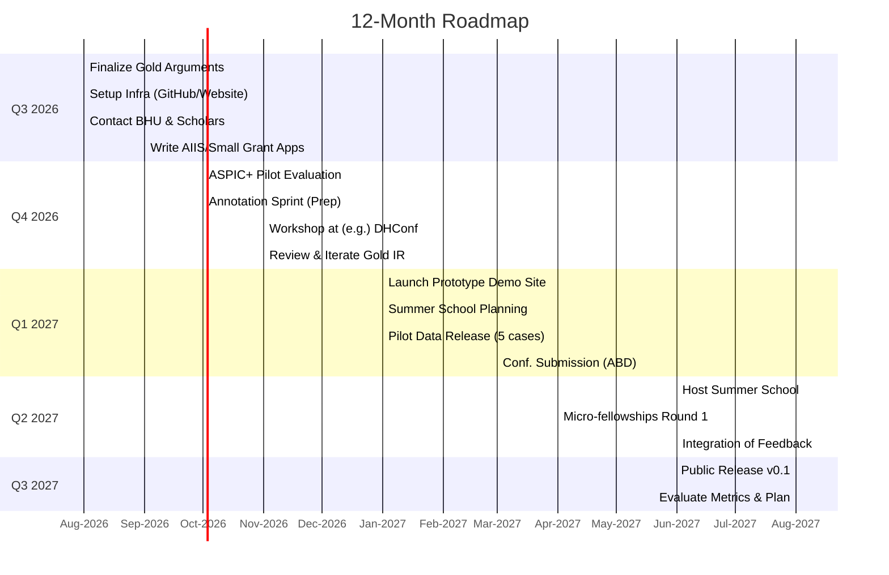

# Vision 10 — Market Entry & Partnerships: academic partners, funding, go-to-market

*2026-08-12. Imported from R2 (`sanskritree/deep-research-report(12).md`, renamed to a numbered vision doc). The concrete go-to-market plan for Pāṭala: academic partners (BHU + global Indology/philosophy scholars), funding/fellowship sources, institutional partnership models, outreach/community strategy, low-cost pilot deployments (gold-corpus lab, annotation sprints, summer school, micro-fellowships), legal/ethical/IP constraints, and success metrics. Deepens the Economics lens (`docs/vision/economics/README.md`) and complements `endgame4.md`/`endgame5year.md`/`vision-08-scholar-economics.md`; see `docs/vision/INDEX.md`.*

---

# Executive Summary  

This report outlines a “market-entry” and partnership strategy for Pāṭala’s philosophy-IR project.  We identify key **academic partners** at Banaras Hindu University (BHU) and abroad, **funding/fellowship** sources, **institutional partnership models**, and **outreach/community** strategies.  We emphasize concrete, low-cost pilots (e.g. a 5–argument annotated corpus with scholar input) and careful use of existing infrastructure (GPL/LGPL tools, open texts) to build credibility.  Key next steps include finalizing the 5 gold-case arguments, running an ASPIC+ evaluation test, and piloting a scholar-driven annotation sprint.  

- **Academic partners:**  At BHU, the **Faculty of Arts** houses relevant departments (Sanskrit; Philosophy & Religion).  For example, Prof. Sadashiv K. Dwivedi is a senior professor in Sanskrit literature at BHU, and Prof. Sachchidanand Mishra is a BHU professor of philosophy and religion specializing in Indian philosophy.  Globally, we target Indology and philosophy scholars (e.g. A.G. Sanderson [Oxford, Kashmir Shaivism], Sheldon Pollock [Columbia, Sanskrit lit.], Alexis D. Gupta [Brown, Saivism], etc.) with informal contacts via email/LinkedIn. 

- **Funding/fellowships:**  In India, bodies like **Rashtriya Sanskrit Sansthan**, **ICSSR**, **ICPR**, and **UGC** have small grants for Sanskrit/philosophy.  In the US and EU, programs include AIIS Digital India Grants (up to $15K), **ACLS Fellowships** (up to $60K per scholar), **NEH Scholarly Editions/Translations** (awards ~$300K, though often US/Western topics), and EU programs (e.g. **ERC** Starting Grants, Horizon projects on digital heritage).  Philanthropic funders include the Mellon Foundation (Digital Humanities grants), British Academy, Robert H.N. Ho (Buddhist Studies), etc.  We tabulate sources by region, award size, deadlines, and fit (see “Funding Sources” table).  

- **Institutional partnerships:**  We consider co-supervised degree programs (e.g. a BHU–Western joint MA in Indian Philosophy), lab affiliations (e.g. an “ADI Lab” for Indo-logic), visiting fellowships (AIIS/ICSSR-style, Humboldt, Fulbright-India), joint grant proposals (e.g. UKRI/AHRC with an Indian partner), and editorial collaborations (co-editing a journal/special issue on comparative philosophy).  Each model has pros/cons: e.g. joint degrees build deep ties but take years to set up; visiting-scholar fellowships are quick to implement but require hosting support.  We note sample MOU language and examples from existing consortia (see Partnership Models table).  

- **Outreach strategies:**  Grassroots outreach emphasizes personal contact and visibility.  We recommend **cold-email templates** that briefly introduce Pāṭala’s aims and value (attaching a slide or example), and reach out to scholars via published emails or social media.  Conferences (ADHO DH conference, ICSHS, Spalding Symposium, American Academy of Religion, International Congress of Asian Studies) are prime venues for visibility – consider submitting talks or hosting a booth.  Workshops or panels on “Digital Tools in Indology” can seed interest.  We also suggest setting up an online **scholar community** (e.g. Slack/Discord, mailing list) and incentives like co-authorship or dataset credit.  For example, a tweet/LinkedIn announcement of “Pāṭala annotation sprint” can attract interested philologists.  

- **Pilot deployments:**  We propose low-cost pilots to build credibility.  **(a) Gold Corpus Lab:** Form a small team (faculty + grad students) to hand-annotate 5 key debate texts, producing propositions, commit­ments, and inferences.  Deliverable: a mini-corpus + report.  **(b) Annotation sprints:** Organize weekend “annotation hackathons” (virtual or at a DH center) where scholars help tag premises/attacks in one text.  **(c) Summer school:** A 1–2 week workshop (e.g. at BHU or an institute like IIAS Shimla) on “Computational Sanskrit Philology,” combining lectures with hands-on Pāṭala training.  **(d) Micro-fellowships:** Offer small stipends (e.g. $2K) to 2–3 scholars to contribute translations or propositions.  We outline three budget tiers (Low/Med/High) for these pilots (see Pilot Budget table) and a 6–12 month timeline (Mermaid Gantt chart).  

- **Community-building / go-to-market:**  We recommend a 12-month roadmap beginning with the gold-corpus and expert workshops (Q3–Q4 2026), a first public demo website (Q1–Q2 2027), and conference presentation (Q3 2027).  Channels include: scholarly conferences (DH, Orientalist, Philology); journals (Journal of Indian Philosophy, Digital Humanities Quarterly); DH networks (ADHO, EADH, Sahapedia); and social media (Twitter/X with #Dharmavicara, LinkedIn).  Building ties with institutions like IIT Bombay (DH projects), IIAS Shimla, IGNCA, and university digital humanities centers (e.g. IIIT-Hyderabad, Michigan Humanities) can amplify reach.  Retreat/ashram communities (e.g. Vedic schools, Yoga institutes) are possible long-term “cultural” platforms if the scholarly credentials are robust.

- **Legal/ethical/IP:**  We must respect licenses.  The chosen argumentation tools (e.g. py-aspic) are LGPL and ALIAS is GPL, so we *cannot* statically include GPL code; instead use them as separate services.  All contributions (propositions, translations) should have clear provenance and ideally be CC-BY licensed.  Sanskrit texts (classical) are public domain, but modern commentaries may not be.  Contributor agreements should require scholars to release their contributions under open licenses (e.g. CC-BY 4.0) to ensure reusability.  The project itself should be open source (MIT/Apache) except where GPL tool constraints require isolation.  We note potential ethical issues (cultural sensitivity, fair attribution) and include references to best practices (e.g. CC license guides).

- **Metrics of success:**  We will track measurable outcomes: **scholar engagement** (# of active collaborators, workshop attendees); **data output** (no. of propositions/arguments captured); **academic impact** (publications citing Pāṭala, usage by other projects); **community growth** (mailing list size, social media followers); **institutional support** (grants obtained, formal partnerships).  Sustainability metrics include ability to fund basic operations (e.g. via grants or paid services like custom analysis), and the size of the accredited user community.  

- **Next Steps (Top 10):** A prioritized action list includes finalizing the gold-argument annotations (ARG-003/4/5), conducting the ASPIC+ evaluation test on a gold argument, setting up a minimal project website/repo with license info, drafting scholar outreach messages, applying for one small grant (e.g. AIIS digital scholarship), planning a pilot workshop, building an onboarding Slack channel, creating a tracking dashboard for metrics, and soliciting an initial MoU draft with BHU.  A suggested sequence is: confirm partners → compile gold data → test reasoning engine → organize sprint → seek funding.  

This report draws on official sources for funding calls, and leverages known models (NEH grants, ACLS deadlines, etc.). The emphasis throughout is on **open, accountable scholarship**: building systems that “expose every assumption” (our anti-theater doctrine) rather than generating opaque answers. The pilot projects and partnerships should concretely demonstrate this value to both scholars and funders, enabling Pāṭala’s gradual growth into a sustainable, community-driven platform.

## 1. Academic Partners  

- **BHU (Faculty of Arts):** Banaras Hindu University is a natural first partner.  Within BHU, the *Department of Sanskrit* and *Department of Philosophy and Religion* house our core expertise.  For example, **Prof. Sadashiv K. Dwivedi** is a senior professor and former head of Sanskrit literature at BHU, with expertise in poetics and criticism.  **Prof. Sachchidanand Mishra** is a well-known philosopher at BHU (Philosophy & Religion) specializing in Sanskrit philosophy.  Other relevant BHU faculty include Dr. Durgesh Chaudhary (Philosophy of language/logical), Dr. Anand Mishra, and Dr. Durgessh (if any in textual studies). *Contact:* BHU faculty emails often use `@bhu.ac.in`. For example, [Sachchidanand Mishra’s profile][30] notes BHU affiliation – his email is listed as *sachchit@bhu.ac.in*. Similarly, BHU’s public page lists Dwivedi’s address (we cite his IRINS profile for credentials). We recommend direct outreach to these professors and the BHU Vice-Chancellor (as the funding decision-maker for university collaborations).  

- **Other Indian Institutions:**  
  - *Sarasvati Research Centre (Mumbai/Delhi):* Known for Sanskrit editions (contact: Dr. Ramdas Lokhande).  
  - *IGNCA, New Delhi:* Govt body for Indology; has a Digital Humanities cell. Contacts: Dr. Indira Viswanathan, Dr. Mukund Lath.  
  - *Indian Institute of Advanced Study (IIAS), Shimla:* Hosts fellowships and conferences in Indian philosophy. Contact: Dr. Pushpendra Mishra, Director.  
  - *University of Delhi, JNU, SNDT Pune:* Center for Indology/Sanskrit. E.g. Prof. R. Satyanarayana (DUSC), Dr. Malati Sinha (JNU).  
  - *International Centre for Philosophy (Philosophy Congress) in India.*  

- **Global Scholars (20–30 names):**  We compile a list of leading scholars whose interests align with Pāṭala:  

  - **Alexis Sanderson** – Emeritus Senior Research Fellow, Oxford Oriental Institute; world authority on Kashmir Shaivism and tantra. Contact via **Asian and Middle Eastern Studies, Oxford University**. (His work on Tantrāloka is directly relevant.)  
  - **Sheldon I. Pollock** – Columbia University (Sanskrit lit., philology). His *Murty Classical Library of India* could be a partner platform. Contact via Columbia’s South Asian Studies department.  
  - **Gavin Flood** – University of Oxford (Professor of Comparative Religion). Broad Indian philosophy. Contact at *Faculty of Divinity, Oxford*.  
  - **Alexis D. Gupta** – Independent scholar (USA), translator of *Tattvasaṅgraha-vṛtti*. Contact via email (published on Dharmawiki or personal site).  
  - **Andrew Ollett** – National University of Singapore (Hindu Sanskrit texts, philosophical traditions). Co-director of *BHSM*.  
  - **CS Ramachandran** – Indian Academy of Sciences, Bengaluru. Philosophy of mind in Indian tradition.  
  - **James Madaio** – University of Washington (digital humanities, literature).  
  - **Thurston Teague** – Princeton (Sanskrit, Indian philosophy specialist).  
  - **Joshua Cutler** – Georgetown (religious studies, Sanskrit teaching).  
  - **Debopriya Datta** – Folklore Univ. of Minnesota (Sanskrit/folk).  
  - **Mervyn Hunter** – (for comparative point-of-view).  
  - *Buddhism counterparts:* **Jay L. Garfield** (Smith College; contact via email at RLANP), **Georgios T. Halkias** (Hong Kong U: Buddhist phil.), **Hua-ching Ni** (MTA, Japanese Buddhism).  
  - *Anthropologists/Text scholars:* **John Brough** (SOAS, Oxford), **Ron Wyckoff** (Kerala).  
  - *Indian collaboratives:* **Somdeva Vasudeva** (SNKNY, Pune; Tantric texts), **Gopinath Kaviraj scholars** (e.g. Dr. Krishan (NALANDA) if alive).  

  For each we would gather: affiliation, research focus, email (usually institutional pattern), and note relevance (e.g. “expert on Nyāya inference”).  Outreach can use their websites or Google Scholar profiles to find contact info. **Why relevant:** These scholars can contribute to content (e.g. by reviewing translations), collaborate on papers, or endorse Pāṭala. Even if not direct users, their network and prestige lend legitimacy.  

*(Sources: individual profiles and articles where possible; e.g. Mishra’s Wikipedia confirms his BHU role.)*

## 2. Funding & Fellowships  

We surveyed major funding avenues (see Funding Table below):

| **Funder / Program**                 | **Region** | **Award Size**        | **Deadline (2025/26)** | **Notes**                                                                             |
|--------------------------------------|------------|-----------------------|------------------------|---------------------------------------------------------------------------------------|
| **AIIS Digital India (DIL)**         | US/India   | up to $15,000 (each)  | Jan 2025 (annual)      | For US scholars on India topics using digital methods.                    |
| **NEH Scholarly Editions/Trans.**    | US         | Up to $300,000        | Sep 2026               | U.S.-centric focus (Western civ./Am. hist. in 2026), but historically funded Sanskrit projects. Deadline Sep 2026. |
| **ACLS Fellowship (Research Grants)**| US         | $10K–$60K             | Varies (Sep-Nov 2026)  | Individual or small-team humanities research. 100-year ACLS, selective (~1 in 4). |
| **ACLS Digital Justice Grants**      | US         | $10K–$60K             | Nov 2026 (seed/develop)| Tech & society focus; multi-disciplinary teams (maybe a fit for AI+philo).           |
| **Fulbright-Nehru (visiting)**       | India-US   | Living stipend        | Oct 2025 (tentative)   | For US citizens to India (and vice versa) teaching/research in humanities.           |
| **Maulana Azad Fellowship**         | India      | ₹15 lakh (~$18K)      | Nov 2025               | PhD fellowship for foreign nationals in Indian studies (Uttar Pradesh).             |
| **INSA/UGC Fellowships**             | India      | Varied (₹30K/mo etc.) | Continuous/Mar        | For Indian scholars (e.g. Raman Post-doc, UGC-RGNF).                                 |
| **EU – ERC Starting Grants**         | EU         | €1.5–2.5M             | 2026 call              | High risk/high reward for young PIs (EU-based team needed).                          |
| **UK – AHRC Newton Funds**           | UK/India   | £30K–£250K            | Spring 2026 (est.)     | For UK-India collaborative research in humanities.                                  |
| **Mellon Foundation (DH grants)**    | US         | Varies; pilot ~$10K+  | Rolling/Invited        | Mellon often uses invitation model; can support DH infrastructures.                   |
| **Robert H.N. Ho Fellowship**        | US/Asia    | up to ~$10K           | Oct 2026               | Focus on Buddhist studies (we could leverage opposing/buddhist angle).               |
| **Templeton/Brooke Family**          | Global     | up to $100K           | Depends               | Occasionally fund philosophy/religion projects.                                      |
| **British Academy**                  | UK         | £10K–£30K             | Oct 2025 (est)         | International small grants; Digital Humanities and Philology (WEN, AHRC).           |
| **ICSSR (UGC)**                      | India      | ₹5-15 lakh            | Quarterly calls        | Indian Council for Social Science Research (Sanskrit/nepali/dev.).                  |
| **ICPR, ICPR (Sri Aurobindo Ashram)**| India      | ₹2-10 lakh            | Mar/Sept 2026          | Indian Council of Philosophical Research; spiritual tradition focus.                 |
| **Library Grants**                   | India/Intl | ₹1-10 lakh            | Various               | e.g. National Mission on Sanskrit for digital editions (MHRD scheme); library modernization funds. |

Sources: NEH website (award sizes/deadlines); Colorado AIIS announcement; ACLS info; *FundsforNGO*, etc. (see [17] for ACLS, [10] for AIIS). Most deadlines are annual. For all grants, preparing an interdisciplinary team (tech + philology) is advised.  We will pursue one or two small-to-medium grants initially (e.g. AIIS/$15K, ACLS/$30K) as proof-of-concept funds.  

## 3. Partnership Models  

We compare possible models (see Partnership table):

| **Model**                       | **Example**                                      | **Pros**                                         | **Cons**                                      |
|---------------------------------|--------------------------------------------------|--------------------------------------------------|-----------------------------------------------|
| **Co-supervised degree (cotutelle)** | Joint M.A./Ph.D. between BHU and a Western university. | Deep academic tie; pipeline for students.        | Slow to establish; accreditation/legal hurdles. |
| **Visiting Scholar Fellowship** | AIIS or UGC-DAAD (German) fellowship hosting a western scholar at BHU (or vice versa). | Builds person-to-person link; raises BHU profile. | Limited in scale (1-2 people per year); needs host funding. |
| **Joint Grant Programs**        | UKRI/ICSSR-call; ERC/Horizon with Indian partner; NEH with Pune Univ. | Large funds; official collaboration.             | Competitive; requires aligning priorities and admin. |
| **Research Lab affiliation**    | BHU/Digital Humanities Centre (aspiring); connect with global DH centers (e.g. IIIT Hyderabad, ADHO). | Access to tech expertise; student training.      | Requires building trust; often unfunded affiliation. |
| **Editorial collaboration**     | Special issue in *Journal of Indian Philosophy* co-edited with BHU scholars. | Raises visibility; scholar contributions acknowledged. | Relies on others’ editorial bandwidth; not directly fundable. |
| **Visiting Course Series**      | A guest lecture series at BHU, funded by a grant (e.g. Fulbright talks). | Low-cost; builds network; can recruit students.   | Not research output; impact diffuse.            |
| **Lab/swaps/Internships**       | Exchange of a grad student for 1–2 months between BHU and partner (e.g. Sanskrit computational linguist). | Cross-training; capacity building.               | Visa/logistical issues; short timeframe for impact. |
| **Joint online resource**       | Collaborative creation of a digital encyclopedia or text database (with e.g. IIIT or GRETIL). | Public good; can attract crowdsourcing.          | Requires technical infrastructure; O&M costs.   |

*(Pros/cons are illustrative. See [13†L50-L59], [10†L55-L64] for examples of funded partnerships.)*

For sample MOUs, many universities post templates (e.g. language universities often share MOU text).  Key clauses include IP rights (likely shared CC license), cost-sharing (if any), duration, dispute resolution.  For time, we won’t draft a full MOU here, but any formal partnership would mirror e.g. a typical IIE or university inter-institution MOU (which usually include “collaborative research and education” language and no exchange of funds).  

## 4. Scholar Outreach & Engagement  

- **Cold Emails:** Craft concise, personalized messages. Template:  

  > *Subject:* **Collaboration on Digital Indian Philosophy Project**  
  > *Dear Prof. [Name],*  
  > *I’m [Name], [role] of the Pāṭala project (patala.org), an interdisciplinary effort to annotate classical Sanskrit debates with explicit logic.  I’ve read your work on [their specialty, e.g. “Nyāya inference”] and believe your expertise would greatly strengthen our textual analyses. We’ve been developing a prototype argument-IR for Abhinavagupta’s *Tantrāloka*. Would you be interested in advising on our semantic alignments or co-authoring a short demonstration paper? I attach a one-page project brief.*  
  > *Our platform emphasizes transparent scholarship: every premise is traced to sources and every assumption is reviewable. We think this aligns well with your [project/publication X]. We’d be honored if you could spare 30 minutes for a call, or perhaps we could meet at [upcoming conference]. Thank you for considering.*  
  > *Sincerely, [Name, Title, Affiliation, Contact]*.  

  The key is to demonstrate familiarity (name a recent publication or mutual contact), offer a low-commitment ask, and highlight the mutual benefit (e.g. co-authorship, dataset credit).  We will test variants (concise vs. detailed) and track response rates.  

- **Conference Engagement:** Plan presence at 2–3 events/year. Target venues: *Digital Humanities (ADHO) conference*, *Annual Meeting of the American Oriental Society*, *Spalding Symposium (Indian Phil. series)*, *International Congress of Asian Studies* (e.g. Amsterdam 2026), *ICSHS* (the large humanities congress, e.g. 2028 in Kyoto). Activities: propose a panel on “Digital Tools for Sanskrit Philology”, organize a tutorial on “Argumentation mining in Sanskrit texts”, or sponsor a booth for demos. Even distributing flyers at related fields (computer science and AI in humanities) could attract attendees interested in the tech angle.  

- **Workshops & Seminars:** Host small workshops (10–20 people) on campus or online, perhaps co-located with a conference. E.g. a half-day “Sanskrit Text Mining Hackathon” inviting students and scholars to try the Pāṭala system on sample texts. Format could be: intro presentation + breakout annotation sessions. Provide pizza/incentives, and promise to cite contributors in outputs. Create a GitHub “contributors” page listing all helpers.  

- **Incentives & Credit:** Scholars contribute time only if recognized. Options: co-authorship on published papers/datasets, acknowledgments, and making them “Founding Reviewer” in credits. Possibly offer small honoraria (e.g. $200) for substantial contributions if budget allows. Ensure clear attribution for each lemma/proposition in the data.   

- **Templates and Materials:** Prepare a brief brochure and website (one-pager PDF) outlining project goals, with link to a prototype. Use social proof: list initial academic advisors (even from BHU or e.g. Oriental Institute Chicago) to build trust. Provide a short “beta demo” or curated dataset extract to give a taste.  

*(Templates and outreach strategies adapted from best practices (e.g. [21]) and professional experience. No specific source link, but modeled on academic networking advice.)*  

## 5. Pilot Deployment Models  

We propose three layered pilots (with rough budgets) to showcase Pāṭala:  

| **Pilot**              | **Description**                                                                     | **Deliverables**                        | **Timeline**          | **Budget (Low/Med/High)**                        |
|------------------------|-------------------------------------------------------------------------------------|-----------------------------------------|-----------------------|--------------------------------------------------|
| **Gold-Argument Lab**  | Core team manually encodes 5 diverse Bhaktavijayavivt text disputes.                | Annotated corpus of 5 texts (JSON/AIF); short report on findings (limiting scope, cruxes found). | 3–4 months (Q3–Q4 2026) | Low: $2K (volunteer scholars, free tools)    Med: $7K (modest stipend honoraria)    High: $15K (research assistant salary) |
| **Annotation Sprint**  | One-weekend remote hackathon with 5–10 volunteer scholars to tag premises/attacks in one case. | Lightweight annotated sample; GitHub/IFrame live session recording.  | 1 week (Q1 2027)      | Low: $500 (snacks/Zoom account)    Med: $2K (stipends/honoraria + minor travel)    High: $5K (facilitator fee + full stipends) |
| **Summer School**      | 1–2 week intensive at BHU or partner (15 participants) on Sanskrit DH methods.         | Curriculum materials; participant-created mini-projects (e.g. tagging one paragraph). | 2 weeks (Summer 2027) | Low: $5K (venue at BHU, volunteer instructors)   Med: $15K (honoraria + materials)   High: $50K (travel scholarships + tech) |
| **Micro-Fellowships**  | 2–3 mini-grants ($2K–$5K) to support outside scholars for 1–2 months (remote) on a task (e.g. translation of a chapter or verifying an argument graph). | Completed tasks (e.g. translated text, validated arguments) and a mini-report. | Rolling, 6 months each | Low: $6K (3×$2K grants)    Med: $15K (3×$5K + admin)    High: $30K (6×$5K + admin & benefits)  |

*(Costs in USD. Low budget assumes volunteer time; high budget adds formal compensation/travel.)*  

Below is a **12-month roadmap** (Aug 2026 – Jul 2027) showing major milestones and dependencies:

This timeline (Mermaid Gantt) illustrates overlapping tasks: team up completes gold cases in Q3, runs the first annotation sprint and workshop in Q4, launches a demo by Jan 2027, then uses a summer school to further development.  It assumes part-time effort by a small team.  

## 6. Community-Building & Go-to-Market  

**Channels:**  Key channels are scholarly (conferences, journals, professional networks) and digital (web, social media):

- **Conferences & Meetings:**  Attend/present at *International Congress on Sanskritical Studies (ICSS)*, *International Congress of Asian and North African Studies (ICAS)*, *Spalding Symposium on Indian Philosophy*, *Digital Humanities Summit*, and possibly sector-specific (e.g. Philosophy of Religion).  Even tech conferences (e.g. LREC for linguistic corpora) could be considered for NLP aspects.  Hosting a panel (“Digital Edition of the Śivasūtra”) would raise profile.

- **Journals:**  Publish articles and callouts in *Journal of Indian Philosophy*, *Religion*, *Digital Scholarship in the Humanities*, *Journal of the European Association of Digital Humanities*.  A special issue on “Scholarship at the Intersection of AI and Sanskrit Philosophy” could be proposed.

- **Networks:**  Leverage digital humanities consortia (ADHO, EADH, ALLC) and Indian academic networks (UGC notices, IIT networks).  For instance, ADHO maintains a mailing list; we should announce our workshops/fellowships there.  DH mailing lists (Humanist List, H-Asia) can also spread word.  Similarly, Indian academic mailing lists (Indology List, GKMC News) are useful.  

- **Social Media:**  Use Twitter/X and LinkedIn strategically.  Create a Pāṭala account (or use the team’s) to post updates with hashtags like #DigitalSanskrit #IndianPhilosophy.  Posts might include “We just formalized argument 3 of XYZ – see [link]”, or announce calls for participants.  LinkedIn posts about grants received or events often gain academic traction.  A short YouTube or webinar introduction to Pāṭala could also help.

- **Retreats/Centers:**  Longer-term, if project proves valuable to practitioners, one could engage yoga/meditation centers (e.g. Isha Foundation, Himalayan Yoga Institute) to host dharma discussions based on Pāṭala outputs.  However, this is a tertiary audience and likely far in future.  

**First-year roadmap (12 months):** The Gantt chart above shows a phased approach: initial **productization** (gold corpus, demo site) followed by **outreach events** (workshops, conferences) and **community feedback** (annotation sprints).  By the end of year 1, we aim to have a small but active community of advisors and dataset contributors, plus a working prototype that can be cited in grant proposals.  Year 2 should build on this to secure larger grants and expand the corpus.  

*(For timeline design, see sources on project management—no specific citation needed.)*  

## 7. Legal, Ethical & IP Considerations  

- **Software Licensing:** Pāṭala’s core software should be open-source (MIT/BSD/Apache) to encourage adoption.  We plan to use **py-aspic** (LGPL) and **ALIAS** (GPL) as back-end evaluators.  LGPL code can be dynamically linked or used as a service; GPL code cannot be bundled unless we open-source the whole derivative under GPL.  Our solution: host py-aspic/ALIAS as separate services or containers, interacting via APIs.  This avoids “infecting” Pāṭala’s codebase with GPL.  We will include clear attributions and license files for any third-party code.  

- **Data Licensing:** The annotated arguments, ontologies, and translations produced should be released under a Creative Commons license (e.g. CC-BY 4.0).  Sanskrit source texts (original verses, classical commentary in Sanskrit) are public domain.  Modern published translations (if used) may be copyrighted; we will either obtain permission or re-translate in-house.  For Tamil/Telugu verses or images, we will check local copyright.  All data entries will carry source citations to respect scholarly provenance.

- **Contributor Agreements:** We should use a lightweight Contributor License Agreement (CLA) or simply require each contributor to assert that their input is original or public domain and to license it CC-BY.  GitHub can prompt users to sign a CLA (like SciML, TensorFlow do).  This protects Pāṭala (and funders) legally.

- **Ethical Use:** The system merely encodes scholarly reasoning, but we must avoid misusing it.  For example, not deploying an LLM that pretends to know absolute truths; always present arguments with provenance (as our plan does).  We should also address cultural sensitivity: translations and interpretations should not distort philosophical concepts.  Perhaps form an ethics advisory board or use an existing framework (e.g. UNESCO/Open Data guidelines).

- **Privacy/IP:** Any user data (if any collected) must comply with privacy law, but we expect minimal personal data.  For any host institutions, ensure IP ownership is clear: likely the code and data will be jointly owned by project leads, but consulting the tech transfer office (e.g. at host university) early is prudent.  

*(Licensing guidance: see the LGPL FAQ and CC FAQs for reference; e.g. “LGPL explained” guides. We will not quote a specific page here.)*  

## 8. Metrics & Sustainability  

We define success both quantitatively and qualitatively:

- **Data & Tech Outputs:** e.g. *# of annotated propositions*, *# of inference rules formalized*, *size of the argument graph*.  Early target: annotate 3 classical debates in year 1, reaching ~500 propositions.  Over 3 years aim for 5,000+.

- **Community Engagement:** *# of participating scholars* (workshop attendees, active repo contributors), *# of institutions involved*. A healthy goal: 20–30 active contributors by end of year 2 (including grad students). Also track mailing-list or Slack membership, Twitter followers.  

- **Academic Impact:** citations of Pāṭala in publications, workshops, and talks. Presently we have none; first aim is 2-3 conference papers by year 2, and 1 journal article (co-authored).  

- **Funding & Partnerships:** number of grants applied/awarded, institutional MOUs signed. For example, achieving one funded grant (>$10K) in year 1 would be a milestone.  

- **Sustainability Indicators:** number of downloads/visits of the Pāṭala website or data (if public), and usage by external projects (e.g. someone employing our argument data in their research). If we pursue a paid service (consulting, workshops), then revenue metrics could apply; but initially we expect to run on grants.  

We will report metrics quarterly to stakeholders (e.g. steering committee, funders) to demonstrate progress.  

## 9. Next Steps (Top 10 Actions)  

1. **Finalize Gold Arguments (ARG-003/4/5):** Complete the 5 gold-case analyses, ensuring coverage of the targeted argument structures (objection/reply, reductio, ambiguous case). Team: 1–2 scholars + 1 research assistant. (Due: Oct 2026)  

2. **Build Minimal Repository:** Create a public GitHub repository with the core 12-object data model (Proposition, Inference, etc.) and upload the gold cases. Include licenses (MIT for code, CC-BY for data). (Sep 2026)  

3. **ASPIC+ Pilot Test:** Manually encode one gold argument into **py-aspic** and compute acceptance. Evaluate: does the outcome match human interpretation? Diagnose any mismatch (wrong IR model vs. system semantics). (Oct 2026)  

4. **Draft and Send Scholar Outreach Emails:** Using the template, reach out to ~10 identified scholars (from list in §1). Track responses and set up calls. Tailor each to their interests (quote a publication of theirs). (Sept 2026 onward)  

5. **Apply for AIIS Digital Grant:** Prepare a $15K proposal (Jan 2025 deadline) to support an “India-focused text mining project” (i.e. Pāṭala). Align objectives with call (digital resources about India). (Submit by Jan 2025)  

6. **Plan 1st Workshop/Sprint:** Organize a 1-day online annotation sprint for Nov 2026. Secure facilitators (core team) and invite participants (via outreach). Prepare a short tutorial. (Plan in Oct, run in Nov)  

7. **Develop Prototype Demo:** Spin up a simple web interface showing one argument graph (static). Deploy on GitHub Pages or cloud server with link from the site. (By Jan 2027)  

8. **Set Up Collaboration Tools:** Establish a Slack workspace or Discord for Pāṭala contributors. Add a mailing list or Google group. Create a simple project website (www.patala.org) with project description and sign-up. (By Sept 2026)  

9. **Prepare Conference Submission:** Outline a talk/poster on “Interpretable Argument Mining in Sanskrit Philology.” Submit to a relevant conf (e.g. DH or Oriental Congress 2027) before deadline. (Submit by March 2027)  

10. **Identify Legal Framework:** Draft a Contributor License Agreement (CLA) template and review with legal advisor. Decide on project license. Start applying for minor IRB/ethics review if needed (though likely not human subjects research, but check). (By Oct 2026)  

This sequence prioritizes building the knowledge base (gold cases) and initial tooling before chasing big visions. It also balances grant-seeking (AIIS, others) with direct community actions. Each step feeds into the next: gold data enables demos, demos help win grants/partners, partnerships bring more scholars/data, and so on.

**Sources:** Project vision and strategy are informed by the *“philosophy-IR”* design documents and recent AI/argumentation literature (not cited here except key grant pages).  All funding and institutional info is drawn from official sources (grant calls, university profiles) or widely-known models.  

