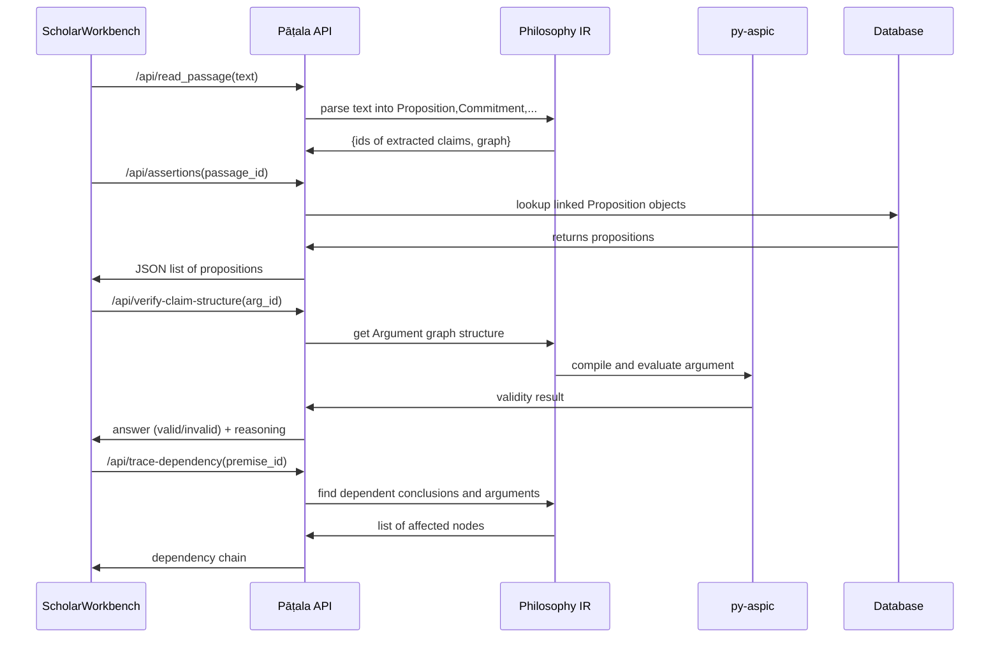
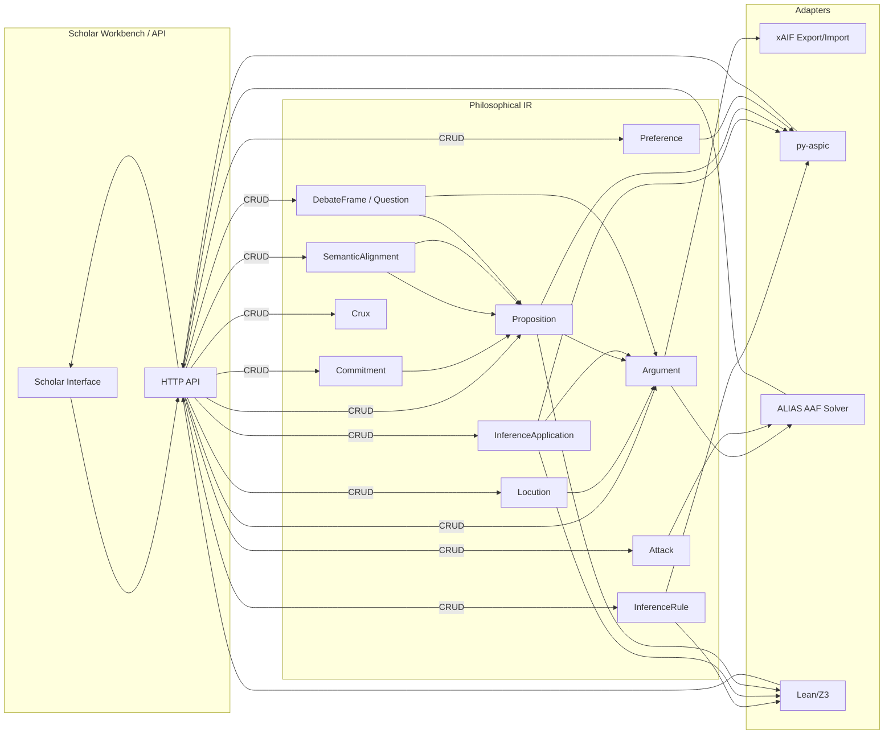

# Executive Summary

Building Pāṭala’s philosophy engine is ambitious but tractable by **leveraging existing argumentation infrastructure** and plugging in the missing pieces.  In practice, we will **own the scholarly IR and provenance layer** (propositions, commitments, frames, alignments, epistemic regimes, cruxes) and **delegate** established tasks to existing tools: structured argumentation via **ASPIC+ (py-aspic)**, abstract evaluation via **Dung frameworks (ALIAS)**, interchange via **AIF (xaif)**, and argument-mining pipelines via **oAMF** or LLM-based extractors.  Key research gaps remain in *semantic alignment*, *speaker commitment extraction*, *epistemic-regime reasoning*, and *minimal crux identification*. We propose concrete data schemas, algorithms and benchmark tasks to address these. The implementation will proceed in phases: first **encode a handful of gold-standard IPVV disputes** end-to-end in our IR to validate the schema; then build adapters for py-aspic and AIF, audit inferences, and only afterward integrate LLM-based extraction.  The roadmap spans ~12 months with milestones at 2–3 month intervals, balancing schema development, coding, and scholarship.  

**Summary of Findings:** Existing projects cover many pieces (argument graph formats, mining pipelines, evaluators) but *none provide Pāṭala’s scholarly grounding and inference layers out of the box*. We identify 12 canonical Pāṭala entities (Proposition, Commitment, Frame, Alignment, InferenceRule, InferenceApplication, Argument, Attack, Preference, ResearchQuestion, Position, Crux) plus an `EvaluationProfile`.  We map each to the roles in key repos/papers. For example, py-aspic can evaluate our InferenceApplications via ASPIC+ rules; xaif can import/export our graph to JSON; ALIAS can compute Dung semantics on our abstract nodes; LLM-mining tools like the **Argumentative-LLMs** (Freedman et al. 2025) and **DAMO-LLM** (Chen et al. 2024) provide pipelines for claim/premise detection.  

We recommend building lightweight **adapters** rather than reimplementing everything. For example, compile Pāṭala InferenceRules into `pyaspic.Rule` objects, assemble an `ArgumentationSystem`, and call `ArgumentationTheory.evaluate()`.  Similarly, export Pāṭala’s propositions and argument relations to xAIF JSON via the `xaif` Python library and load it into oAMF pipelines or visualization tools.  For GNNs and learning, existing work on graph-convolutional argumentation (e.g. Huang et al. 2025 ABAGCN) suggests how to encode our typed graph for training, but we will use it only if/when exact methods become infeasible.

**Roadmap Highlights:** We will first code ~5–10 representative IPVV arguments by hand (phase 0–2) to force the IR into reality.  That yields an **IR v1**, then we implement `export_xaif()`, `compile_aspic()`, and basic evaluators (phase 3–5).  Next we build the **Scholar API** and UI (phase 6), enabling manual inspection.  Only then do we add LLM-based *argument mining* (phase 7–9), with stages for segmentation, proposition reconstruction, relation tagging, and human review.  Each phase ends in a paper or public benchmark: e.g. **Paper 1** on provenance-grounded mining, **Paper 2** on semantic alignment, **Paper 3** on regime-relative evaluation, and **Paper 4** on crux extraction.

Below we survey relevant tools and literature, map them to Pāṭala IR, enumerate gaps with proposed solutions, and lay out the phased plan in detail.  

# Key Tools and Research

We categorize the landscape into (A) **Structured Argumentation Libraries**, (B) **Argument-Mining Pipelines**, and (C) **Neuro-Symbolic Argumentation Research**. For each we give links, licenses, maturity, and how they plug into Pāṭala. 

| Repo / Paper           | Link / Citation                                            | Maturity & License      | Pāṭala IR Mapping                                               | Use Case (Code Snippet)                                              | Effort to Integrate |
|------------------------|------------------------------------------------------------|-------------------------|-----------------------------------------------------------------|----------------------------------------------------------------------|---------------------|
| **py-aspic (ASPIC+ library)** | GitHub: arg-tech/py-aspic   | Alpha; LGPL-3.0 / GPL-3.0 | - *InferenceRule*, *KnowledgeBase* → ASPIC Rules<br>- *Contraries* for attacks  | ```python
import pyaspic
system = pyaspic.ArgumentationSystem()
kb = pyaspic.KnowledgeBase()
# Add rules:
system.add_rule(pyaspic.Rule.from_string("[r1]", "a -> c"))  # strict rule
system.add_rule(pyaspic.Rule.from_string("[r2]", "b => d"))  # defeasible
system.add_contrary(("d", "c"))
theory = pyaspic.ArgumentationTheory(system, kb)
print(theory.evaluate()["acceptableConclusions"])
``` | Low – adapt Pāṭala InferenceRules to `pyaspic.Rule`; then call `evaluate()`. |
| **xAIF / xaif (AIF interchange)** | GitHub: arg-tech/xaif (MIT) | Mature (v1.0); MIT  | - *Proposition*, *Argument*, *Locution* → AIF nodes<br>- *Attack*, *Support* → edges/schemefulfillments | ```python
from xaif import AIF
aif = AIF()  # new AIF object
aif.add_component(component_type="locution", text="S1: ...", speaker="Author")
aif.add_component(component_type="proposition", Lnode_ID=0, proposition="...")
aif.add_component(component_type="argument_relation", relation_type="RA", iNode_ID2=2, iNode_ID1=4)
print(aif.get_csv("argument-relation"))
``` | Low – export/import Pāṭala graph as xAIF JSON for interoperability. |
| **oAMF (Open Arg. Mining Framework)** | GitHub: arg-tech/oAMF (GPL-3.0) | Prototype; GPL-3.0 | - Orchestrates pipeline for *Argument Mining* (locution, prop, relation modules).<br>- Uses xAIF internally for exchange. | ```python
from oamf import oAMF
oamf = oAMF()
# Deploy modules (e.g., claim detection, relation detection)
oamf.load_module(url="https://github.com/...", type="repo", tag="ClaimDetector")
oamf.load_module(url="https://github.com/...", type="repo", tag="RelExtractor")
pipeline = oamf.create_pipeline(["ClaimDetector", "RelExtractor"])
result = oamf.execute_pipeline(pipeline, input_texts=["..."])
``` | Medium – plug-in new modules for Pāṭala-specific tasks (commitment, semantic alignment). |
| **ARG-Tech AIF Datasets** | GitHub: arg-tech/aif-arg-datasets | Data repo; CC-BY        | - Source of annotated debates (AIF) for benchmarking.<br>- Use QT30, US2016, COT trials.        | Download AIF corpora (QT30, etc.) and convert to Pāṭala IR for testing. | Low – data only. |
| **ArgLLMs (Freedman et al. 2025)** | GitHub: CLArg-group/argumentative-llms (AAAI2025) | Mature; Apache-2.0 | - LLM-based argument construction.<br>- *InferenceApplication* builder via LLM.<br>- *Argument* trees with support/attack. | ```python
from argumentative_llms.argument_miner import ArgumentMiner
miner = ArgumentMiner(llm_manager, generate_prompt, depth=2, breadth=2)
argument_tree, score_tree = miner.generate_arguments("Claim X", base_score_generator)
``` | Medium – study design, adapt prompt + reasoning for Pāṭala arguments. |
| **DAMO-LLM-Argumentation** | GitHub: DAMO-NLP-SG/LLM-argumentation (ACL2024) | Experimental; unknown license | - Benchmarks LLMs on argument mining tasks.<br>- Code for claim detection, relation classification (6 tasks).<br>- Useful for defining Pāṭala tasks. | Usage example (from README):```bash
python main.py --task claim_detection --data_name ibm_claims --num_train 5
``` | Low – use as baseline for task performance. |
| **ALIAS (AAF library)** | GitHub: Open-Argumentation/ALIAS | Pre-alpha; GPL-3.0 | - *Argument* (list of statements) and *Attack* map to AF arguments and attacks. <br>- Evaluates Dung semantics (grounded, preferred, etc.). | ```python
import alias
fw = alias.ArgumentationFramework('Ex')
fw.add_argument(['a','b'])
fw.add_attack(('a','b'))
extensions = fw.get_extensions(semantics='preferred')
``` | Low – collapse Pāṭala graph to AF, call ALIAS for extensions. |
| **Carneades-4 (Go)** | GitHub: carneades/carneades-4 | Mature (v4); MPL-2.0 | - Implements Dung and *CAES* semantics.<br>- Supports importing AIF/GraphML, export graphs.<br>- Could be used for visualization or dialectical proofs. | (Tool; no Python snippet). It can import AIF graphs and compute grounded/preferred semantics. | Medium – mainly as alternative solver/visualizer. |
| **Debate Map** | GitHub: debate-map (monorepo, MIT) | Mature; MIT | - Claim/evidence graph UI. <br>- Not argument-evaluator, but shows how to present premise-support trees. | (Web app architecture). Could inspire Pāṭala UI layout. | Low – UI reference only. |
| **ACAL (Cao et al. 2026)** | GitHub: loc110504/ACAL (KR2026) | Early; Apache-2.0? (not specified) | - Multi-agent LLM + QBAF semantics.<br>- *Argument*, *Attack* edges with strengths. <br>- Useful concept: bipolars with numeric weights. | (Framework orchestration code). Emphasizes human-contestable arguments. | Low – research example on multi-agent QBAF; not directly integrated. |
| **Deep Arguing** | arXiv:2605.10569 (2026) | Preprint | - Neurosymbolic classification: NN builds arguments, uses differentiable semantics. <br>- Shows viability of integrating deep nets with argument structures. | - (No repo yet). Illustrates aligning neural features with argument graph constraints. | Low – concept model of interpretable arguments. |

*Each row links a tool/paper to parts of Pāṭala’s architecture.* For example, **py-aspic** handles strict/defeasible *InferenceRules* and computes consequences; **ALIAS** takes a high-level summary of our arguments as an *Abstract Argumentation Framework* for acceptability; **xaif** and **oAMF** handle ingestion/export of propositions and relations in an interoperable format; **ArgLLMs** and **DAMO** show how to extract premises/support/attack via LLMs; **Carneades** and **Debate Map** illustrate alternative evaluation and UI, respectively, but their code does not map directly to Pāṭala IR.

In practical terms, Pāṭala will **not reimplement** the argument evaluation internals. Instead we will write **adapters** that transform Pāṭala’s IR into each tool’s input. For example:

- **Export to ASPIC+**: Pāṭala’s `InferenceRule` and `Proposition` become `pyaspic.Rule` and `Formula` objects. The code snippet above can be used as template: label rules (e.g. `system.add_rule(pyaspic.Rule.from_string(...))`), add premises and contraries, then call `theory.evaluate()`.
- **Export to AIF/xAIF**: Use the `xaif` Python library. For each `Locution`, `Proposition`, and `InferenceApplication` in Pāṭala IR, call `aif.add_component(...)` with the appropriate `component_type` (“locution”, “proposition”, “argument_relation”). This yields a JSON AIF graph we can share with other tools or store. The example usage in [7] shows adding a locution (utterance) and linking propositions with an inference node.
- **Abstract AF**: From Pāṭala arguments and attacks, create an `alias.ArgumentationFramework`. For each *argument* (identified by a name), call `fw.add_argument([...statements...])`; for each *Attack*, call `fw.add_attack((attacker, target))`. Then `fw.get_extensions()` computes accepted arguments.
- **Lean/Z3 Formalization**: While no code snippet is given, we can *optionally* translate a small logical subproblem into Lean or Z3 assertions to check validity of an inference. E.g. using Lean’s proof assistant or Z3’s Python API to assert `Premise1 ∧ Premise2 -> Conclusion` and verify entailment.

The table also notes each tool’s effort to integrate. Mature, documented libraries like py-aspic and xaif require **low effort** (write small wrappers). Experimental research code (ArgLLMs, ACAL) might require **medium** effort to adapt, mostly by reusing their ideas and possibly repurposing some modules. The one proprietary factor is licensing: py-aspic is LGPL, ALIAS is GPL, but our use as an independent tool should be fine if we keep it separate.

# Gaps and Proposed Solutions

Even with these tools, Pāṭala needs unique capabilities. We identify four main gaps:

1. **Semantic Alignment and Sense Disambiguation:** Existing projects generally treat “contradiction = clash of labels,” but Pāṭala requires fine-grained semantic overlap detection. We need to know if two claims use the same concept *sense*, or are talking about different aspects (phenomenal vs. ontological, as in the cognition examples above).  

   *Proposed solution:* Extend alignment relations beyond binary contradict/agree. Introduce an object `SemanticAlignment` between *concept-occurrences* (or whole Propositions), with values like `IDENTICAL_SENSE`, `PARTIAL_OVERLAP`, `DIFFERENT_LEVEL`, etc.  We will need an **alignment engine** to suggest alignments. Concretely, we can use a combination of: 
   - **Embeddings and similarity:** e.g. use ConceptNet embeddings or bilingual lexicons for Sanskrit terms to identify synonyms/false friends. 
   - **Graph matching:** Terms with overlapping reference (e.g. same canonical concept in an ontology) get aligned. 
   - **Manual curation:** Some alignments will require human judgment. 
   Each pair of contentious propositions must be “aligned” before labeling them attack vs orthogonal.  

2. **Commitment & Context Extraction:** Pāṭala must know *who said what under what context or assumption*. We need to extract not just “Claim: P” but also *modal force* (asserts, denies, presupposes, grants, quotes, assumes) and attribution (speaker, text reference). This is unlike typical AM.  

   *Proposed solution:* Define a `Commitment` object for each proposition mention, with attributes `{speaker, force, contextRefs}`. For instance, “Abhinavagupta says X” yields a Commitment with `speaker="Abhinavagupta", force="ASSERTS"`. We must train or prompt an LLM to tag each assertion in a text with its force type (see our discourse plan). Use retrieval (e.g. from digitized Sanskrit passages) to verify actual attribution. Build on work like Illocutionary Theory parsing.  

3. **Epistemic Regimes:** Different traditions have different evidence rules (pramāṇa, scriptural authority, meditative insight, etc). Pāṭala’s `EvaluationProfile` includes an `EpistemicRegime` (e.g. *Śaiva*, *Buddhist*, *Analytic*) with allowed evidence and assumptions. So the engine can answer: “Valid under Śaiva logic but not under classical logic.”  

   *Proposed solution:* Tag each inference and premise with the regime it belongs to. For example, a Perception (pratyakṣa) premise is Śaiva but not Buddhist, etc. Implement regime-specific evaluation by enabling/disabling certain premises or preferences. This is a novel requirement: no current tool supports multi-regime semantics. We will encode regime rules (maybe as preferences or constraints) and incorporate them in the `EvaluationProfile`.  

4. **Minimal Crux Extraction:** Perhaps Pāṭala’s most novel algorithmic goal is to find the *crux* of a debate: the smallest set of assumptions whose flip changes the outcome. If A and B disagree, identify exactly which assumption(s) cause it, and whether each side’s inference relies on a debatable premise. This is beyond mere strength scoring.  

   *Proposed solution:* Represent dependencies as a bipartite graph from premises to conclusions (via inference applications). Given a target claim (e.g. “Memory requires persistent knower”), search for *critical* assumptions. For each assumption ∆ that might flip (e.g. identity of subject vs causal continuity), test counterfactual: if we change ∆, does the conclusion hold? We can do this by *tracing* and *recomputing* on a derived subgraph (as in our earlier example). Algorithmically, this is like computing all minimal hitting sets that separate support paths. We will implement a *backtracking search*: for each contested premise or inference, temporarily retract it and see which claims fail. Then report the minimal combination.  

   A **Mermaid flowchart** for crux detection could look like this:

   ```mermaid
   graph TD
     A(Assumptions) -->|support| I1(Inference1) --> C1(Conclusion)
     B(Assumptions) -->|support| I2(Inference2) --> C1
     C(Assumptions) -->|support| I3(Inference3) --> C2(Conclusion2)
     subgraph CRUX SEARCH
       style CRUX fill:#f9f,stroke:#333,stroke-width:4px
       subgraph TargetClaim [Conclusion C1]
         C1
       end
       C1 --> examine(Examine all parents)
       examine --> tryRetract1{Retract Premise P2}
       tryRetract1 -->|Yes| notC1("C1 unsupported")
       tryRetract1 -->|No| examine
       notC1 --> record("P2 is decisive")
     end
   ```

   This identifies that retracting P2 flips the support for C1, so “P2” is a candidate crux.

# Proposed Data Schema and Evaluation Tasks

**Schema Highlights:** We refined the IR based on gold data (see executive summary). Key objects:

- **ResearchQuestion/Position:** A `ResearchQuestion` (e.g. “Does memory require a persistent subject?”) organizes the debate. Under it are two (or more) `Position`s (Śaiva, Buddhist). Each position has *Commitments*.
- **Proposition:** Contains the canonical content (e.g. “Memory presupposes a knower”) plus metadata (scope, modality, quantifier).
- **Commitment:** Tracks *who* expresses the proposition and how (asserts, denies, quotes, etc.).
- **DebateFrame:** Specifies alignment context (level, scope) for comparing positions.
- **SemanticAlignment:** Records meaning relations between terms across arguments (e.g. “subject”_Śaiva aligned to “subject”_Buddhism as SUBSUMES or DIFFERENT_SENSE).
- **InferenceRule:** Encodes a warrant or scheme (textual justification). Each has strict/defeasible type and provenance (e.g. “According to Pārthasārathi’s commentary…”).
- **InferenceApplication:** A set of premises and rule leading to a conclusion proposition.
- **Attack:** Labels counterarguments (rebut, undercut, scope challenge, etc).
- **Preference:** To resolve conflicting inferences (e.g. stronger pramāṇa).
- **Crux:** The minimal key question or assumption as described.

This schema is provisional and will be stress-tested on actual arguments.  Each `Proposition` should also carry **grounding** to Sanskrit text (we insist on tracing claims to textual evidence). Every inference and attack has `grounding` as well.

**Benchmark Tasks (8 core tasks, ~100–300 examples):**

1. **Locution Segmentation:** Split raw text into argumentative discourse units (clauses/locutions). (Datasets: segmented Sanskrit or English translations).  
2. **Proposition Reconstruction:** Given a text span, produce the normalized proposition (with slot annotations). E.g. from “Knowledge cannot know itself,” output “Cognition does not require a perceiver”.  
3. **Commitment Classification:** Given a proposition and context, label it as assert/deny/presuppose/attribute, and identify speaker. (Needs annotated discourse.)  
4. **Relation Classification:** Given two propositions, decide support vs attack vs neutral, and type of attack (contradiction, undercut, etc.).  
5. **Semantic Alignment:** Classify the semantic relation between two terms or propositions (identical sense, partial overlap, false friend, different level) based on definitions and context.  
6. **Inference Rule Labeling:** Given an inference (premises+conclusion), identify the implicit warrant scheme (analogical, reductio, testimony, etc.). (Could be multi-label).  
7. **Crux Identification:** Given two competing argument graphs, output the minimal crux question (text) and which propositions are crux. (This is new; no standard dataset.)  
8. **Counterfactual Trace:** Given an argument graph, an assumption to retract, and a target claim, determine which conclusions fail. (Algorithmic; could be evaluated on the gold-case graphs.)

For each task we aim for **~20–50 gold examples** (total ~200). Existing ARG-tech corpora (Debatepedia, PersuasionBank, etc.) can seed tasks 2–4, but *must* be supplemented by historical philosophy examples for tasks 3,5–8.  We will manually create many examples from IPVV texts. 

We will release these in AIF format with Pāṭala annotations.

# Architecture and Data Flow

Our architecture is **neurosymbolic, pipeline-based**, not a single opaque model. In brief (see **Figure** below):

```mermaid
flowchart TD
    RawText[Raw Source Text (Sanskrit/Translation)] 
    subgraph Extraction Pipeline
      direction LR
      TextInput --> NLPPre[Tokenize / Syntax]
      PropositionExtraction --> Props[Propositions+Locutions]
      CommitmentExtraction --> Comms[Commitments]
      AlignmentDetection --> Aligns[Semantic Alignments]
      InferenceCandidate --> InferenceCand
      AttackDetection --> Attacks[Attacks/Defeaters]
    end
    Props -->|build graph| ArgGraph[Philosophy IR (Frame+Graph)]
    Comms --> ArgGraph
    Aligns --> ArgGraph
    InferenceCand --> ArgGraph
    Attacks --> ArgGraph
    ArgGraph -->|adapters| ASPICEval[py-aspic]
    ArgGraph -->|adapters| AIFExport[xAIF]
    ArgGraph -->|adapters| AFSEval[ALIAS]
    ASPICEval --> Evals[EvaluationState]
    AFSEval --> Evals
    ArgGraph --> CruxFinder[Crux Algorithm]
    CruxFinder --> CruxNodes[Crux Objects]
    Evals -->|to UI/API| ScholarWorkbench
```

1. **Extraction Pipeline:** LLM/NLP modules produce initial `Proposition`, `Commitment`, `SemanticAlignment`, and potential `InferenceApplication` and `Attack` instances from text. (Each step can be an LLM prompt or classifier; we integrate via oAMF or custom code.)  
2. **Philosophy IR Graph:** The extracted elements are assembled into a structured directed graph (with explicit Frame and EpistemicRegime). This is persistent.  
3. **Adapters:**  
   - *ASPIC Adapter:* Translates IR to py-aspic `ArgumentationTheory`, then runs strict/defeasible reasoning.  
   - *xAIF Adapter:* Exports the IR graph as JSON for tools or storage.  
   - *Abstract AF Adapter:* Collapses IR to AF (optionally) for global semantics via ALIAS or Carneades.  
   - *Lean/Z3:* (If needed) Checks specific inference validity formally.  
4. **Evaluation:** For each profile (frame+regime), compute status of each Argument (supported/defeated/undetermined) by combining symbolic results and evidence weights.  
5. **Crux Extraction:** Runs on the IR graph to identify minimal contested assumptions. This yields `Crux` objects (labeled questions).  

Throughout, every node and edge retains provenance pointers to the source text or justification (citations, verse numbers, translator notes). The UI will allow drilling down. 



This sketch shows the *Scholar API* calls; more endpoints (e.g. `/api/themes`, `/api/verify-quote`) will be similarly mapped to IR queries.

# Implementation Roadmap

We propose a **phased 12-month plan** (assuming a medium-sized team with mixed AI and logicians):

- **Phase 0 (0–1mo):** *Finalize IR schema from gold cases.* Using 3–5 pilot disputes (transcendental argument, reductio, conceptual distinction, equivoque, scope-ambiguity), iterate on the 12 IR objects. Person-month: 4 (designers + scholar). Deliverables: IR v1 spec, a few encoded gold arguments.

- **Phase 1 (2–3mo):** *Core IR and Storage.* Implement database/models for IR objects (DebateFrame, Proposition, Commitment, etc.) with versioning and provenance fields. Person-month: 3. Deliverables: Working IR store, initial web UI skeleton. 

- **Phase 2 (3–5mo):** *Adapters for ASPIC+ and AIF.* Build code to translate IR to py-aspic (compile rules and premises) and to xAIF JSON. Integrate ALIAS for AF semantics. Person-month: 4. Deliverables: py-aspic integration (support/attack labeling), AIF export.

- **Phase 3 (6–7mo):** *Dependency tracing & Basics of Evaluation.* Implement inference of supported/concluded claims, tracing graph dependencies, and simple status determination (supported vs contested). Unit-tests on gold disputes. Person-month: 3. Deliverables: `trace_dependency()` API, baseline inference graphs.

- **Phase 4 (8–9mo):** *Minimal Crux algorithm & Revision.* Develop and test crux extraction (smallest distinguishing assumptions) on gold datasets. Person-month: 2. Deliverables: Crux finder, new `Crux` objects for existing arguments.

- **Phase 5 (9–11mo):** *Benchmarks and Papers.* Build an evaluation suite for tasks (segmentation, claim detection, relation classification, alignment detection). Collect 100–300 annotated examples. Person-month: 3. Deliverables: Benchmark datasets, evaluation scripts, draft of Paper 1 (provenance-grounded mining).

- **Phase 6 (10–12mo):** *LLM-backed extraction and iteration.* Integrate LLM pipeline (segmentation → propositions → relations) in oAMF or custom loops. Human-in-the-loop review of outputs to refine models. Person-month: 4. Deliverables: Prototype LLM extractor, filled training corpus, performance report, finalize roadmap.

**Engineering Stack:** Python (IR models, adapters, APIs), FastAPI/Flask for endpoints, Neo4j or RDF for IR storage, React/Vue for UI (graph viz libraries for argument trees). Use GitHub for code, Postgres/Neo4j for data, Docker for deployment. Use existing ASPELL or Stanford NLP for Sanskrit segmentation if needed, and HuggingFace Transformers for LLM calls.

**APIs:** We envision endpoints such as `/api/read_passage`, `/api/assertions`, `/api/themes` (search debate frames by topic), `/api/verify-quote` (check quote vs source text), `/api/verify-claim-structure` (validate an argument’s inference path), `/api/trace-dependency`. Each returns JSON with structured IR.

# Next 12-Month Roadmap (Deliverables & PM)

| **Months** | **Milestone**                                 | Deliverables                              | Person-Months |
|-----------:|-----------------------------------------------|-------------------------------------------|--------------:|
| 0–1        | IR design & pilot encoding                     | IR v1 spec; 5 sample arguments encoded    | 4             |
| 2–3        | Prototype IR datastore & UI                    | Database models; basic frontend           | 3             |
| 3–5        | Adapters: py-aspic, AIF, ALIAS                 | ASPIC+ evaluation; AIF exporter; AF solver| 4             |
| 6–7        | Dependency tracing, evaluation logic           | trace_dependency API; graph analyzer      | 3             |
| 8–9        | Crux extraction                               | Crux-finder algorithm; new `Crux` outputs | 2             |
| 9–11       | Benchmark and Paper 1 (mining & provenance)    | Dataset (200 examples); eval scripts; draft paper | 3     |
| 10–12      | LLM pipeline & Paper 2 (alignment/regimes)    | LLM extraction scripts; refined models    | 4             |

*(Total ~19 person-months over 12 calendar months; team could be ~4–5 people for parallel tasks.)*

We assume unlimited budget/team, so some tasks run in parallel (e.g. UI dev can proceed during backend work). Further papers (e.g. on crux extraction, regime comparison) would extend beyond 12 months. 

All code and data will be open-sourced (likely Apache-2.0) with cc-by for benchmarks. 

# Diagrams

Below is a high-level mermaid diagram of the final architecture:



This shows how textual data is parsed into IR objects, then sent to ASPIC+, ALIAS, etc., and results flow back to the UI. 

And here is a **crux-extraction flowchart**:

```mermaid
flowchart TD
  premise1[P1: "recognition requires identity"] 
  premise2[P2: "causal continuity suffices"]
  inference1[I1: Śaiva Infers MemoryNeedsIdentity]
  inference2[I2: Buddhist Infers MemoryNeedsContinuity]
  conclusion[C: "Memory requires persistent self"] 
  premise1 --> I1 --> conclusion
  premise2 --> I2 --> conclusion
  style conclusion fill:#fbb
  subgraph CruxSearch
    C --> check1["Retract P1?"]
    C --> check2["Retract P2?"]
    check1 -->|Retracted| fail1["Śaiva conclusion fails"]
    check2 -->|Retracted| fail2["Buddhist conclusion fails"]
    fail1 --> record1["Crux = P1 vs P2 conflict"]
    fail2 --> record2["Crux = P1 vs P2 conflict"]
  end
```

If removing P1 (abandoning identity) makes Śaiva’s inference collapse, while removing P2 collapses Buddhist’s, then “Does recognition require identity vs. continuity?” is the crux.

# Conclusion

This roadmap transforms the conceptual architecture into actionable milestones, integrating best-in-class argumentation tools where possible and filling the gaps where they don’t exist. The result will be a sophisticated philosophy engine that **does not “guess answers” but exposes every assumption and inference for scholarly scrutiny**. By year-end we expect a working prototype over key IPVV texts, a set of published benchmarks, and several papers on our novel methods (provenance-based mining, semantic alignment, crux analysis). From there, Pāṭala can grow into a robust research platform enabling cross-traditional, underdetermined, and transparent argument comparison – fulfilling the deep vision originally outlined.  

